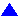
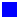

# Технологические контуры в предварительном планировании

Концепция технологического контура позволяет при планировании установки ориентироваться не только на стандарты DIN и ISA, но и на рекомендации системы NAMUR (например, NA 50). Конструирование структуры предприятия осуществляется в навигаторе предварительного планирования. Кроме этого, в навигаторе предварительного планирования можно создавать и обрабатывать сегменты структуры, технологические контуры, функции ТК, резервуары и общие объекты планирования, а также управлять ими.

### Технологические контуры

Технологические контуры в предварительном планировании управляются параллельно с общими объектами планирования и ведут себя так же. На технологических контурах можно сохранять макросы, но нельзя сохранять изделия или шаблоны функций. Технологические контуры представляют собой измерительные контуры или исполнительные механизмы.

Технологический контур обозначается как MSR или EMSR. EMSR является обозначением электрической, измерительной, управляющей или регулирующей техники. В компании EPLAN используется понятие технологический контур. Сокращение "ТК" означает 'Технологический контур'.

Номер ТК согласно рекомендациям NAMUR соответствует в EPLAN обозначению технологического контура в диалоговом окне 'Свойства'. Из свойств, перечисленных ниже, это обозначение, т. е. номер ТК, составляется автоматически:

* Техническое оборудование: Это свойство позволяет присвоить технологическому контуру другое дополнительное буквенное обозначение.
* Измеряемая величина: Измеряемая величина описывает показатель процесса технологического контура.
* Функциональный признак прибора: Технологический контур может иметь несколько функциональных признаков приборов. Функциональные признаки приборов описывают задачи функций ТК, присвоенные технологическому контуру.
* Номер: Эта часть номера ТК в EPLAN является обязательной. Номер позволяет систематически нумеровать технологические контуры и при необходимости различать контуры с одинаковыми измеряемыми величинами и функциями признаками.

Идентифицирующие элементы номера ТК вместе с обозначениями вышестоящих сегментов позволяют идентифицировать технологический контур в структуре проекта. Номер ТК, включая обозначения вышестоящих сегментов, отображается в свойстве Полное обозначение.

Часть номера ТК задается при копировании и вставке технологических контуров в соответствии с [конфигурацией](planninggui_d_konfigsegmentdef.md) определений сегмента. В навигаторе предварительного планирования и в диалоговом окне Свойства можно повторно пронумеровать технологические контуры. Другие части номера ТК (например, измеряемая величина) учитываются при нумерации, только если эти свойства заданы в [настройках нумерации](planninggui_d_einstellpltstellen.md) как идентифицирующие.

Для представления технологических контуров на функциональной схеме автоматизации по стандарту DIN EN 62424 в диалоговом окне Свойства технологических контуров доступны следующие три свойства:

* Релевантно для безопасности (Ид. 44060)
* Относится к GMP (Ид. 44061)
* Релевантно для качества (Ид. 44062).

С помощью символов, дополнительно отображаемых в графическом редакторе, можно определять, имеют ли размещенный измерительный контур или исполнительный механизм значение для безопасности, качества или GMP.

Если соответствующие флажки в таблице свойств установлены, а свойства на вкладке Вид добавлены в порядок свойств, то на условных обозначениях размещенных измерительных контуров или исполнительных механизмов в графическом редакторе отображаются следующие дополнительные символы:

Символ |  Значение
---|---
{: .ui-icon } |  Релевантно для безопасности
{: .ui-icon } |  Относится к GMP
(GMP означает "Good Manufacturing Practice" = Надлежащая практика организации производства).
{: .ui-icon } |  Релевантно для качества

Эти специальные свойства также можно вывести в отчетах, маркировке и свойствах блока для объектов планирования (напр., в случае с типом отчета "Предварительное планирование: План объекта планирования" в форме "Таблица параметров технологических контуров"). Для отображения символов для технологических контуров, имеющих значение для безопасности, качества или GMP на страницах отчета по стандарту DIN EN 62424 можно использовать технические средства с помощью свойства формы Присвоение свойства / значения графике (ид. 13026). Для присвоения графики в одноименном диалоговом окне в библиотеке символов GRAPHICS предусмотрены символы PCS_SQU, PCS_CIR и PCS_TRI.

### Функции ТК

Функция технологического контура описывает (под-)функцию технологического контура. При этом имеется в виду функция измерения или функция потребления.

### Резервуар

В технологии производственных процессов резервуары относятся к группе аппаратов. Они могут составлять часть установки и вставляться под слой сегментов структуры.

В предварительном планировании управление резервуарами осуществляется параллельно с общими объектами планирования, их поведение имеет сходства. Хотя в одном резервуаре могут быть сохранены шаблоны функции и внешние документы/страницы, однако это не представляется возможным в отношении адресов ПЛК, изделий и макросов. Соответственно диалоговое окно 'Свойства' резервуара имеет в наличии только одну вкладку Резервуары, общая информация, которая соответствует резервуару объекта планирования, и вкладки Документы/страницы и Шаблоны.

В предварительном планировании резервуар можно вставить под структурный сегмент, но не под объект планирования или технологический контур. Сами резервуары могут содержать в структуре технологические контуры и объекты планирования.

**См. также:**

* [Предварительное планирование](planninggui_k_start.md)
* [Предварительное планирование: Принцип](planninggui_k_prinzip.md)
* [Предварительное планирование: Порядок действий](planninggui_k_vorgehensweise.md)
* [Создание и обработка сегментов структуры](planninggui_h_struktursegmenteerstlbearb.md)
* [Создание объектов планирования, технологических контуров, функций ТК, резервуаров и объектов планирования (соединений)](planninggui_h_planungsobjekteerstellen.md)
* [Вставить графику форм](formeditorgui_h_formulargrafikeneinfuegen.md)
* [Автоматизация зданий](planninggui_k_gebaeudeautomation.md)
