# Технологические контуры / функции ТК на функциональной схеме автоматизации

Технологические контуры / функции ТК на функциональной схеме автоматизации отображаются в виде функциональных символов. Эти функциональные символы находятся в библиотеке символов Special.slk.

### Типы ТК (уст./реал.)

Для технологических контуров и функций ТК имеются различные типы ТК (уст./реал.). В зависимости от типа ТК (уст./реал.) используются разные функциональные символы.

В таблице ниже представлен выбор возможных типов ТК (уст./реал.) и зависимость между местом и функциональным символом.

Расположение / реализация |  |  По месту |  Пункт управления |  Измерительная станция |  Пункт управления (невидимый) |  Измерительная станция (невидимая)
---|---|---|---|---|---|---
|  |  ***1***  |  ***2***  |  ***3***  |  ***4***  |  ***5***
Общее |  ***1***  |   |  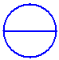 |  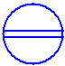 |  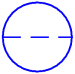 |  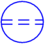
PCS |  ***2***  |  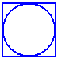 |  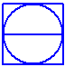 |  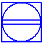 |  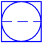 |  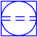
Управл. компьютер |  ***3***  |   |  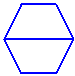 |   |   |  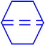
ПЛК |  ***4***  |  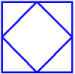 |  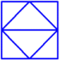 |  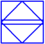 |  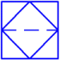 |  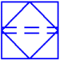

**См. также:**

* [Функциональные схемы автоматизации в предварительном планировании](planningri_k_start.md)
* [Резервуары и выводы резервуара на функциональной схеме автоматизации](planningri_k_rifliessbild.md)
