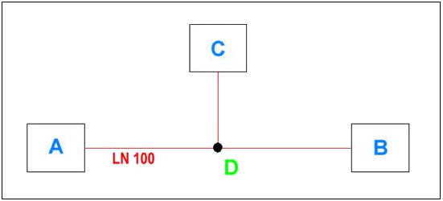

# Ответвления для трубопроводов

Для проектирования трубопроводов в функциональной схеме автоматизации можно использовать символ соединения "Пересечение". Ответвление имеет три вывода устройства: два, проводящих соединение, и один, на котором соединение заканчивается. Если вы разместите такой символ на линии автоматического соединения в функциональной схеме автоматизации, начиная с этого ответвления, образуется новый сегмент трубы, тогда как в электротехнике в этом месте образуется второе полное соединение.

### Сгенерированные соединения

На следующем рисунке представлена ситуация, когда три функции / устройства A, B и C соединены друг с другом через символ соединения D при помощи линий автоматического соединения.

За счет использования ответвления в качестве символа соединения D в функциональной схеме автоматизации генерируются следующие соединения:

Источник |  Цель
---|---
A |  B
C |  LN 100

### Вставка ответвлений

Для вставки ответвления выберите пункты меню Вставить > Символ соединения > Пересечение. Символ ответвления появится рядом с курсором, и его можно будет разместить на странице. При помощи кнопки ++Tab++ можно пролистать имеющиеся варианты. Само ответвление от прямого или зигзагообразного соединения обозначается в символе стрелкой. Диалоговое окно Свойства для пересечений ***не*** предусмотрено.

!!! example "Пример:"

    В качестве примера ответвления далее на рисунке представлен вариант A символаTPIDL:Между выводами 1 и 2 проходит прямое соединение. Стрелкой на выводе устройства 3 показано ответвление.

Стрелка для маркировки ответвления находится на слое EPLAN555 для символа соединения. Предварительные настройки для этого слоя в управлении слоями выбраны таким образом, что стрелка в графическом редакторе и при распечатывании не видна. Чтобы просмотреть невидимые элементы, такие как эта стрелка, нажмите клавишу ++U++.

При вставке символа отключенные элементы всегда видимы, а указанная стрелка позволяет выбрать нужный вариант.

!!! tip "Совет:"

    Для пересечений в библиотеке символов SPECIAL у вас есть два символа: TPIDA (пересечение на угловом соединении) и TPIDL (пересечение на прямом соединении). Если выбрать пункты меню Вставить > Символ соединения > Пересечение и нажать клавишу ++Назад++, откроется диалоговое окно выбора символа, и вы сможете выбрать один из этих специальных символов.

**См. также:**

* [Определения трубопровода на функциональной схеме автоматизации](planningri_k_rdp.md)
