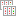
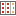

# Диалоговое окно ПЛК — <Имя проекта>

Вы открыли проект. Данные проекта > ПЛК > Навигатор.

В этом диалоговом окне имеющиеся в проекте данные ПЛК выборочно выводятся в представлении в виде дерева или списка и их можно обрабатывать.

Здесь можно обработать все данные ПЛК или отдельных карт ПЛК. Каждая карта перечисляется вместе со своими данными, точками подвода питания, адресами (каналами) и принадлежащими адресам выводов устройства. Кроме того, можно генерировать блоки и выводы устройства ПЛК.

Обзор основных элементов диалогового окна:

На вкладке Дерево выводятся данные ПЛК с сортировкой по структуре проекта. При этом у вас есть возможность выбирать различные виды для отображения данных ПЛК. В зависимости от выбранного вида объекты ПЛК бывают представлены следующими стоящими перед ними пиктограммами:

Пиктограмма |  Значение |  Вид
---|---|---
{: .ui-icon } |  Проект конфигураций |  с ориентацией на адрес / связано с приводами
{: .ui-icon } |  Рабочая станция |  с ориентацией на адрес / связано с приводами
{: .ui-icon } |  ЦПУ |  с ориентацией на адрес
{: .ui-icon } |  Привод |  связано с приводами
{: .ui-icon } |  Канал |  с ориентацией на канал
{: .ui-icon } |  Каркас |  ориентировать по каркасу
{: .ui-icon } |  Карта ПЛК вставлена в каркас |  ориентировать по каркасу
{: .ui-icon } |  Карта ПЛК вставлена в каркас и является каркасом |  ориентировать по каркасу
{: .ui-icon } |  Карта ПЛК вставлена или интегрирована в первичную станцию |  ориентировать по каркасу
{: .ui-icon } |  Карта ПЛК вставлена в первичную станцию и является каркасом |  ориентировать по каркасу
{: .ui-icon } |  Каркас не присвоен или недействителен |  ориентировать по каркасу

(Обзор основных пиктограмм для данных проекта вы найдете в разделе [Пиктограммы для навигаторов](userinterface_k_iconsnavigatoren.md).)

!!! tip "Совет:"

    В представлении структуры дерева также отображаются изделия, присвоенные карте ПЛК. Если выделено такое изделие, то вместе с ним на странице проекта можно разместить привязанный макрос, перетащив его с помощью мыши. Различные виды отображения данных ПЛК в навигаторе ПЛК позволяют быстро найти требуемые функциональные элементы с присвоенными изделиями.

На вкладке Список по умолчанию выводятся автоматический функциональный текст, адрес, а также символический адрес. Дополнительно можно отобразить все другие свойства ПЛК.

### Фильтр

В этом раскрывающемся списке отображаются все доступные фильтры. Выбранный фильтр активируется автоматически и применяется как к дереву, так и к списку. Запись "- Не активировано -" отключает фильтр и приводит к тому, что данные отображаются в неотфильтрованном виде. С помощью кнопки ++...++ откройте диалоговое окно [Фильтр](modaldialogsdb_d_filternnach.md). Здесь можно создать, обработать, удалить, скопировать, экспортировать, импортировать фильтр и управлять им.

Во всплывающем меню раскрывающегося списка Фильтр содержатся следующие записи:

* Выключить: Этот пункт меню доступен, если фильтр установлен: Сбрасывает настройку фильтра до записи "- Не активировано -".
* Активировать <Имя фильтра>: Этот пункт меню доступен, если для настройки фильтра установлено значение "- Не активировано -": Повторно активирует последний активный фильтр.

Таким образом можно быстро переключаться между неотфильтрованным и отфильтрованным в соответствии с требованиями пользователя представлениями.

### Значение: <Свойство>

При помощи [быстрого ввода](modaldialogsdb_k_filter.md) в данном поле для определенного и активированного фильтра можно быстро изменить значение его критерия.

### Всплывающее меню

Всплывающее меню дает доступ, в зависимости от типа поля (например, дата, целое число, многоязычный), к пунктам меню, при помощи которых вы можете по необходимости, например, влиять на представление таблиц или обрабатывать значения в полях. Обзор пунктов этого всплывающего меню вы можете найти в разделе [Пункты всплывающего меню](userinterface_m_kontextmenu.md).

Дополнительно здесь представлены следующие пункты всплывающего меню, специфические для данного диалогового окна:

Пункт меню |  Значение
---|---
Создать |  Открывает диалоговое окно Определения функций и предлагает возможность вставки вывода устройства или блока ПЛК с заданными свойствами. В зависимости от выделенного ранее объекта в диалоговом окне Определения функций в соответствующем месте раскрывается дерево для выбора определения функции. Если, например, на функции вызвано всплывающее меню, в дереве выделяется соответствующее определение функции.
Новые функции |  Открывает диалоговое окно Генерировать функции, позволяющее для новых или уже имеющихся ОУ сгенерировать несколько функций по определенному образцу нумерации.
Новое устройство |  Открывает диалоговое окно Выбор изделия и позволяет создавать устройства.
Удалить |  После запроса удаляет все выделенные функции или — в представлении в виде дерева — все функции, расположенные ниже выделенного уровня структуры дерева. (Возможен многократный выбор функций или уровней древовидной структуры.) Удалены будут как размещенные, так и неразмещенные устройства. При удалении размещенного устройства одновременно с ним удаляется размещение в графическом редакторе или в пространстве листа.

!!! note "Замечание:"

    Обратите внимание, что при удалении размещенных устройств могут измениться также имеющиеся в проекте соединения. Соединения могут быть удалены, или могут возникнуть новые.

Разместить |  Размещает выделенную функцию на схеме соединений. Непосредственно перед размещением нажмите клавишу ++Shift++, чтобы запустить операцию размещения в режиме "Отдельные функции". Нажмите ++Backspace++, чтобы открыть диалоговое окно Разместить устройство и, например, Выбор макросов (при необходимости) или изменить вид представления.
Присвоить |  Данный пункт меню доступен, когда открыта страница проекта и в навигаторе выделены ОУ / функция / шаблон функции. Прикрепляет описание (первой выделенной) функции рядом с курсором и позволяет перенести эту функцию на какое-нибудь условное обозначение и присвоить ее щелчком мыши. Так, можно, например, присвоить неразмещенную функцию условному обозначению или перенести данные уже размещенной функции в другое условное обозначение. Присвоенная функция должна содержать такое же количество выводов, что и условное обозначение (или больше). Если выделены несколько функций или ОУ, все выделенные функции присваиваются по очереди. Присваивать можно каждую функцию отдельно при помощи щелчка мыши или блоком, натягивая рамку на необходимое условное обозначение.
Обработать |  Этот пункт меню доступен, если выделен каркас. Открывает диалоговое окно Обработать каркас, в котором устанавливается последовательность карт ПЛК в этом каркасе.
Адресация |  Этот пункт меню доступен, если выделены выводы устройства ПЛК. Открывает диалоговое окно Новая адресация выводов устройства ПЛК, в котором выполняется новая адресация области выводов устройства ПЛК в пределах управления ПЛК.
Обработать маркеры ревизий |  Посредством данного пункта меню Вы можете обрабатывать тексты маркировки ревизий и их формат. Пункт меню доступен только в том случае, если в ревизии выделен измененный объект.
Удалить маркер ревизии |  Через этот пункт меню можно удалить тексты маркеров ревизии. Пункт меню доступен только в том случае, если в ревизии выделен измененный объект.
Перейти к (перекрестная ссылка) |  Заносит перекрестные функции в список Перейти к и открывает его.
Перейти к (все виды представлений) |  Заносит все виды представлений функции (например, на странице схем соединений, странице обзора и странице отчета) в список Перейти к и открывает его.
Перейти к (графика) |  Переходить на первый размещенный объект, который содержит ссылку на выделенный вывод устройства или блок ПЛК.
Вставить в список результатов поиска |  Заносит все объекты проекта, имеющие ссылку на выделенный элемент, в список результатов поиска.
Список с предварительным выбором (только дерево) |  Уменьшает число отображаемых элементов, чтобы ускорить ориентирование в представлении в виде списка. Если этот параметр активирован, представление в виде списка вызывается с автоматическим фильтром (предварительный выбор), причем этот фильтр содержит только что выбранные элементы.
Выбрать в дереве (только список) |  Показывает выделенный объект во вкладке Дерево.
Вид (только дерево) |  Переключает отображение в представлении в виде дерева:

* С ориентацией на ОУ: Данные ПЛК располагаются согласно структуре проекта по их ОУ.
* С ориентацией на адрес: Данные ПЛК располагаются в пределах структуры проекта по адресам.
* С ориентацией на канал: Данные ПЛК располагаются в пределах структуры проекта по каналам. Выводы устройства ПЛК, не имеющие обозначения канала, упорядочиваются по ОУ.
* Ориентировать по каркасу: Данные ПЛК отображаются в соответствии с присвоением карт ПЛК каркасам. Под картами ПЛК показываются содержащиеся в них функции.
* Связано с приводами: данные ПЛК располагаются в пределах структуры проекта по приводам.

Табличная обработка |  Открывает табличную обработку и обеспечивает обработку свойств выводов устройства и блоков ПЛК.
Свойства |  Открывает диалоговое окно Свойства (усл. обозначение): ++...++. Обеспечивает обработку функции.
Свойства (общие) |  Открывает диалоговое окно Свойства (общие): ++...++. Позволяет обрабатывать свойства устройства.

**См. также:**

* [ПЛК](plcgui_k_start.md)
* [Виды в навигаторе ПЛК](plcgui_k_ansichten.md)
