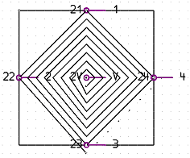

# Принадлежность точек подвода питания к каналу

При определенных графических видах расположения EPLAN распознает автоматически, какие точки подвода питания относятся к выводу В/В устройства. Поиск осуществляется как на страницах схемы соединений, так и на страницах обзора.

### Поиск принадлежности канала на страницах схемы соединений

На страницах схемы соединений поиск начинается на точке подвода питания вверх. Затем поиск продолжается против часовой стрелки на одинаковом удалении ("каждые 15 минут"). Всегда вверху ("до полного часа") интервал повышается.

При обнаружении вывода В/В устройства поиск завершается. Точка подвода питания принадлежит затем к тому же каналу, что и найденный вывод В/В устройства.

!!! example "Пример:"

    На этом примере вывод устройства "1" относится к точке подвода питания "V".

Если поиск находит точку подвода питания, то EPLAN исходит от того, что она относится к тому же каналу. Поиск затем продолжается в том же направлении (т. е. больше не по кругу), пока к этой точке подвода питания не будет достигнуто то же удаление, что и к точке подвода питания, с которой начался поиск. Отсюда поиск продолжается по кругу вокруг обоих выводов устройства.

!!! example "Пример:"

    На этом примере точка подвода питания "V2" относится к выводу устройства "14" и точка подвода питания "V1" относится к выводу устройства "2".

Если поиск снова находит точку подвода питания, то он проходит сначала прямо (пока не будет достигнуто то же удаление, что и до первого вывода устройства) и затем снова по кругу.

!!! example "Пример:"

    На этом примере точка подвода питания "V2" относится к выводу устройства "14", точка подвода питания "V1" относится к выводу устройства "2" и точка подвода питания "V3" относится также к выводу устройства "14".

### Поиск принадлежности канала на страницах обзора ПЛК

Поиск взаимосвязанных выводов устройства осуществляется на страницах обзора по тому же принципу, что и на страницах схемы соединений. Все же имеется одно различие:

На странице обзора поиск начинается ***вниз***, и интервал соответственно увеличивается вниз.

Отсутствует какое-либо сообщение об ошибке, если относительно точки подвода питания не находится канал, так как он может быть задуман.

**См. также:**

* [ПЛК](plcgui_k_start.md)
