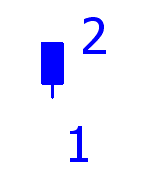
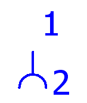

# Управление штекерами

В качестве штекера обозначается комбинация нескольких контактов штекеров. При этом со штекерным контактом можно работать как с ***одной*** функцией (комбинация штырей и гнезд), так и раздельно с ***обеими*** функциями (одна для штыря, другая - для гнезда).

### Общее управление штырями и гнездами

В случае общего управления штырями и гнездами, штекер - это единый элемент.

Для контактов штекера вывод устройства 1 функции – это гнездовой вывод, а вывод устройства 2 – штыревой вывод. (Так задано в определении функции.) Таким образом, на схеме контактов гнезда и штекеры выводятся на раздельные страницы отчетов.

### Раздельное управление штырями и гнездами

При раздельном управлении штырями штекера и гнездами розетки штекер обычно содержит только штыри. Тогда противоположный элемент (блочная или кабельная розетка) содержит гнезда.

Если гнезда и штыри представлены двумя функциями, должны быть заданы их соответствия. Штырь и гнездо штекера рассматриваются как одно целое (т. е. представляют собой замкнутый контакт штекера), если они имеют одинаковые обозначения устройства и одинаковые обозначения контакта штекера. Если требуется, можно задать обозначения вывода устройства на контакте штекера.

!!! example "Пример:"

    XS1:1 соединен с XS1:1; XS1:2 соединен с XS1:2.

#### Штекерные соединения устройств

Штекерные соединения в устройствах широко распространены на практике. В случае штекерного соединения устройства по крайней мере одна из сторон штекерного соединения имеет обозначение устройства (А), в то время как другие стороны имеют обозначение устройства штекерного соединения (X). В EPLAN возможно также управление иерархическими штекерными соединениями(-A-X) и их представление.

### Различные ОУ для штыревой и гнездовой стороны одного штекера.

В случае раздельного представления штырей и гнезд им могут быть присвоены различные ОУ. При помощи специальных символов штырей и гнезд штекера, имеющих так называемые "Прямые выводы устройства", в рамках штекерного соединения (между штырями и гнездами) можно сгенерировать ***Прямые соединения***. В символе с прямым выводом устройства линия, обозначенная на выводе устройства 2, графически не представлена.

Штырь штекера с прямым выводом устройства  |  Гнездо розетки с прямым выводом устройства
---|---
 |  

!!! example "Пример:"

    Прямое соединение между штырем штекера -X1:1 и гнездом розетки -X2:1Для штекерного соединения между -X2 и -X1 используютсясимволыс прямым выводом устройства. Итоговое прямое соединение в схеме соединений отображается графически как линия автоматического соединения только тогда, когда расстояние между обоими символами достаточно велико.

Если штекеры связаны между собой напрямую, то несколько штекеров можно объединить одним обратным эквивалентом. Вы можете произвольно определить, какое ОУ на стороне штыря соединяется с каким ОУ на стороне гнезда. Прямое соединение имеет приоритет перед связью между штыревыми или гнездовыми контактами, задаваемой одинаковыми обозначениями для контактов штекера.

!!! example "Пример:"

    Обратным эквивалентом штекеров -X8 и -X9 (штыри) является штекер -X10 (гнездо). Между штырями и гнездами имеютсяпрямые соединения.

Для неразмещенных контактов штекера вы должны создать неразмещенное прямое соединение в диалоговом окне [Подключить устройства](xesconnectdevicegui_d_geraeteverschalten.md). Если контакты штекера вы разместили на разных страницах или просто не расположили один против другого, то прямое соединение нужно создать вручную. Есть и другой способ: два контакта штекеров можно соединить через точку разрыва. В этом случае соответствующий контакт штекера будет найден через это соединение.

!!! warning "Предупреждение:"

    Для того, чтобы раздельное представление штырей и гнезд обрабатывалось правильно, вы должны задать подходящие определения штекеров для штыревой и гнездовой сторон.

    При раздельной работе со штырями и гнездами в диалоговом окне [Обработать штекер](connectormanagementgui_d_steckerbearbeiten.md) вы можете изменить только ту сторону штекера, на которой находится выбранный контакт. То есть контакт штекера можно переместить со стороны штырей на сторону гнезд и наоборот.

**См. также:**

* [Штекеры](plugsgui_k_start.md)
* [Обработка данных штекеров](plugsgui_k_arbeitsweise.md)
