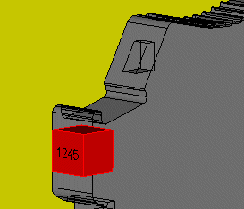

# Показать выводы устройства графически

Выводы устройств на трехмерных размещениях изделий можно отобразить в пространстве листа графически. Таким образом, можно быстрее и проще оценить, подходит ли их позиция и направление вывода для имеющихся сегментов маршрутизации и кабельных каналов, благодаря чему маршрутизируемые соединения смогут безошибочно найти выводы устройства. Если это не так, необходимо изменить направление вывода или расположение сегментов маршрутизации.

В графическом просмотре нельзя удалять, перемещать или дублировать выводы устройства. Данные выводов устройства изменяются в диалоговом окне 'Свойства' размещения изделия.

### Показать обозначения выводов устройства

1. Выберите пункты меню Вид > Обозначения выводов устройства.

!!! info "Для сведения:"

    Выводы устройства размещения изделия отображаются в виде красного прямоугольного параллелепипеда.

!!! info "Для сведения:"

    Обозначение вывода устройства при подходящей 3D-точке наблюдения и сильном увеличении фрагмента видно на передней поверхности красного параллелепипеда.

!!! info "Для сведения:"

    Прозрачность всех размещений изделий, у которых есть выводы, настроена на 50 %.

!!! info "Для сведения:"

    Если курсор касается вывода устройства, появляется всплывающая подсказка с обозначением штекера и обозначением вывода устройства.

### Отобразить направления выводов устройства

1. Выберите пункты меню Вид > Направления выводов устройства.

!!! info "Для сведения:"

    Направление выводов устройств показывается красной стрелкой.

**См. также:**

* [Определить схему соединений в пространстве листа](cabinetgui_h_anschlussdefinieren.md)
