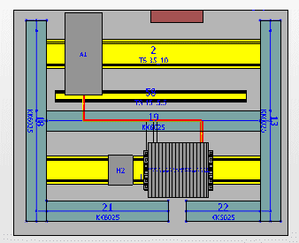
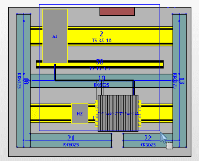
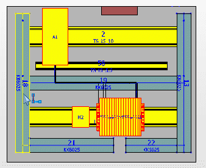
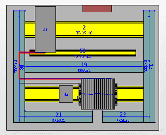

# Определить вход в сеть соединенных сегментов

Трассу маршрутизации для соединения можно определить, задав точку, в которой маршрутизируемое соединение должно входить в сеть соединенных сегментов. Заданное значение можно применять как для маршрутизированных, так и для немаршрутизированных соединений.

* Благодаря этому немаршрутизированные соединения прокладываются в предварительно выбранных сегментах маршрутизации.
* Трасса маршрутизации уже маршрутизированных соединений изменяется в зависимости от заданных значений, а соединения маршрутизируются заново в предварительно выбранных сегментах маршрутизации.

Условие:

Сгенерированы соединения или маршрутизируемые соединения. Включено отображение маршрута. Отображаются маршрутизируемые соединения. Маршрутизируемое соединение, обозначенное на рисунке красным, должно входить не в средний, а в левый кабельный канал сети соединенных сегментов.

1. Выберите пункты меню Данные проекта > Соединения > Войти в сеть соединенных сегментов.

!!! info "Для сведения:"

    Будет выведен запрос выбора источника/цели маршрутизируемых соединений.

2. Укажите две угловые точки прямоугольника, который охватывает нужные объекты.

!!! info "Для сведения:"

    Выбранные источники / цели будут помечены цветом.

!!! info "Для сведения:"

    Отобразится запрос выбора кабельного канала или сегмента маршрутизации, через который соединение должно входить в сеть соединенных сегментов.

3. Выберите кабельный канал или сегмент маршрутизации, через который соединение должно входить в сеть соединенных сегментов. В данном примере кабельный канал расположен с левой стороны.

!!! info "Для сведения:"

    Отобразится диалоговое окно Соединения, в котором перечислены все соединения, содержащиеся в выбранном источнике. Соединения, охваченные при выборе источника и цели, уже выделены в диалоговом окне.

4. Установите флажок в столбце Выбор у тех соединений, которые вы хотите заново маршрутизировать в выбранном сегменте маршрутизации цели.
5. Щелкните по кнопке ++OK++.

!!! info "Для сведения:"

    Выбранные соединения будут направлены в выбранную точку вхождения в сеть соединенных сегментов и маршрутизированы заново.

**См. также:**

* [Изменить маршрутизацию](routinggui_h_verlegewegaendern.md)
* [Показать маршрут](routinggui_h_streckenansicht.md)
