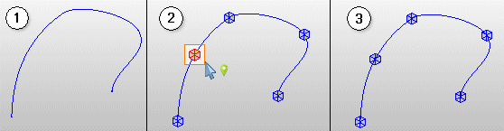

# Вставка новой опорной точки на кривой

Дополнительные опорные точки можно вставлять в любых местах на протяжении кривой. Впоследствии, изменяя новые опорные точки при помощи функции Изменить направление кривой, можно изменить также форму кривой и ее положение в пространстве.

1. Выберите пункты меню Обработать > Графика > Новая опорная точка.

!!! info "Для сведения:"

    В строке состояния отображается требование "Выбрать свободно маршрутизируемое соединение или кривую" ***(1)***.

2. Выберите кривую в пространстве листа или в навигаторе пространства листа.

!!! info "Для сведения:"

    В строке состояния отображается требование "Выбрать позицию для новой опорной точки".

!!! info "Для сведения:"

    Имеющиеся опорные точки отображаются в виде синих параллелепипедов на профиле кривой.

!!! info "Для сведения:"

    Новая опорная точка отображается в виде красного параллелепипеда на курсоре ***(2)***.

3. Подвигайте новую опорную точку вдоль кривой.
4. Разместите новую опорную точку в нужном месте на кривой.

!!! info "Для сведения:"

    Новая опорная точка отображается в виде синего параллелепипеда на профиле кривой ***(3)***.

!!! info "Для сведения:"

    Затем можно разместить другие опорные точки.

!!! tip "Совет:"

    * ***Кривизну*** кривой на опорной точке можно изменить при помощи клавиш [Home] и [End].
    * ***Угол наклона*** кривой на опорной точке можно изменить при помощи клавиши ++Tab++ и комбинации клавиш [Tab] \+ [Shift].

**См. также:**

* [Вставить кривые](routinggui_h_kurveeinfuegen.md)
* [Изменить направление кривой](routinggui_h_kurvenverlaufaendern.md)
* [Выровнять направление кривой по касательной](routinggui_h_kurvenverlauftangential.md)
