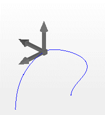
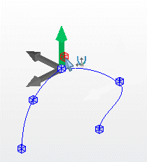
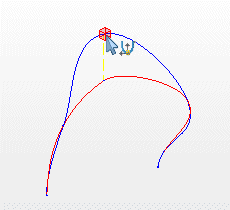
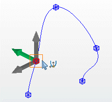

# Изменить направление кривой

Направление кривой можно изменить вручную, перемещая опорные точки.

1. Выберите пункты меню Обработать > Графика > Изменить направление кривой.

!!! info "Для сведения:"

    В строке состояния отобразится требование "Выбрать свободно маршрутизируемое соединение или кривую".

2. Выберите кривую в пространстве листа или в навигаторе пространства листа.

!!! info "Для сведения:"

    В строке состояния отобразится требование "Выбрать опорную точку кривой".

!!! info "Для сведения:"

    Имеющиеся опорные точки отображаются в виде синих параллелепипедов на профиле кривой.

3. Переместите курсор в область рядом с опорной точкой.

!!! info "Для сведения:"

    На опорной точке отобразится система координат с осями X, Y и Z.

4. Переместите курсор на одну из осей.

!!! info "Для сведения:"

    Цвет оси, задетой курсором, изменится на зеленый.

5. Щелкните по зеленой оси и переместите тем самым опорную точку в указанном стрелкой направлении.

!!! info "Для сведения:"

    При смещении опорной точки направление кривой изменится.

6. Если вы хотите передвинуть опорную точку в другом направлении, выберите в той же системе координат другую ось.
7. Разместите опорную точку, щелкнув мышью в нужном месте.

!!! info "Для сведения:"

    Направление кривой представлено в измененном состоянии.

!!! info "Для сведения:"

    После этого вы можете изменить другие опорные точки.

**См. также:**

* [Вставить кривые](routinggui_h_kurveeinfuegen.md)
* [Вставка новой опорной точки на кривой](routinggui_h_kurveneuerstuetzpunkt.md)
* [Выровнять направление кривой по касательной](routinggui_h_kurvenverlauftangential.md)
