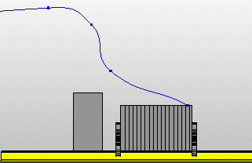
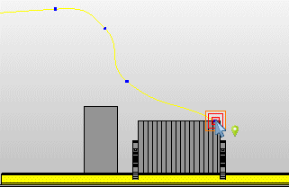
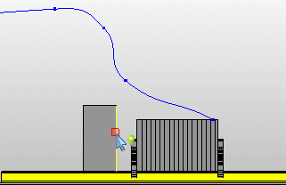
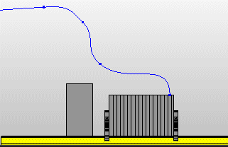

# Выровнять направление кривой по касательной

С помощью этой функции можно выровнять оба конца кривой по касательной к краю. В зависимости от выбранного края это действие может дать разные результаты:

* Конец кривой должен подходить к поверхности не под прямым углом, а по касательной. Такая маршрутизация соответствует монтажным приемам на практике, когда маршрутизированное соединение должно проходить по касательной вдоль монтажной поверхности и крепиться к ней при помощи креплений кабеля / шланга.
* Конец кривой должен входить в вывод устройства вертикально, чтобы избежать изгибания соединений с большими поперечными сечениями.

В следующем примере нужно выровнять направление кривой по касательной к вертикальному краю, чтобы она подходила к выводу устройства вертикально. Точка наблюдения — "Сверху".

1. Выберите пункты меню Обработать > Графика > Выровнять направление кривой по касательной.

!!! info "Для сведения:"

    В строке состояния отображается требование "Выбрать конец кривой".

!!! info "Для сведения:"

    На курсоре отображается красная квадратная рамка захвата; при соприкосновении с курсором кривая выделяется более светлым оттенком.

2. Выберите нижний конец кривой для изменения.

!!! info "Для сведения:"

    В строке состояния отображается требование "Выбрать ребро для тангенциального выравнивания".

3. Выберите вертикальный край объекта.

!!! info "Для сведения:"

    Направление кривой в области нижнего конца кривой закругляется и выравнивается по касательной по вертикальному краю.

!!! info "Для сведения:"

    Затем можно изменить направления других кривых.

!!! tip "Совет:"

    Если при выборе края нажать клавишу ++Shift++, выравнивание по касательной поворачивается на 180°.

**См. также:**

* [Вставить кривые](routinggui_h_kurveeinfuegen.md)
* [Вставка новой опорной точки на кривой](routinggui_h_kurveneuerstuetzpunkt.md)
* [Изменить направление кривой](routinggui_h_kurvenverlaufaendern.md)
