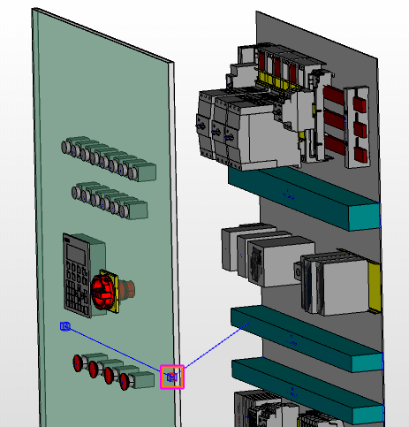

# Вставить сегменты маршрутизации

Сегменты маршрутизации — это вставленные в ручном или автоматическом режиме заданные значения, вдоль которых можно проложить соединения. Графически сегменты маршрутизации обозначаются синими линиями с точками захвата в начале, конце и середине.

***Автоматические сегменты маршрутизации*** создаются при выполнении операции Генерировать сеть соединенных сегментов на основе размещенных кабельных каналов, областей маршрутизации и соединительных отверстий для проводов.

***Ручные сегменты маршрутизации*** привязаны к кабельным каналам и т. д.

* Ручные сегменты маршрутизации задают трассу маршрутизации путем указания произвольной начальной и конечной точек.
* Ручные сегменты маршрутизации чертятся в виде линии.
* Начальную и конечную точки ручного сегмента маршрутизации можно присоединить к точкам захвата уже существующих сегментов маршрутизации (автоматических и ручных).
* Ручные сегменты маршрутизации получают свойство Поперечное сечение сегмента, указывающее на его вместимость. Здесь вы можете вручную указать значение, которое послужит основой при расчете степени заполнения. Если не указано никакого поперечного сечения, степень заполнения не высчитывается.
* Все сегменты содержат свойства Длина и Длина (автоматически). Длина (автоматически) соответствует геометрической длине. В свойстве Длина можно вручную указать значение, если для перемещения соединения требуется резерв длины (например, соединение от двери к монтажной плате).

1. Выберите пункты меню Вставить > Сегмент маршрутизации.

!!! info "Для сведения:"

    В строке состояния отобразится требование: 'Начальная точка сегмента маршрутизации'.

2. Переместите курсор в область рядом с одним из существующих концов сегмента.

!!! info "Для сведения:"

    Конец существующего сегмента окажется захваченным.

3. Разместите начальную точку, щелкнув по захваченной точке.

!!! info "Для сведения:"

    В строке состояния отобразится требование: 'Конечная точка сегмента маршрутизации'.

4. Вытяните сегмент, как линию, в нужном направлении.
5. Произвольно разместите конечную точку или захватите еще одну точку на другом сегменте.

!!! info "Для сведения:"

    Ручной сегмент маршрутизации будет отображен в пространстве листа.

!!! info "Для сведения:"

    Конечная точка последнего сегмента маршрутизации служит начальной точкой следующего сегмента, как у ломаной линии. Эта функция останется активной, пока вы не завершите действие, нажав ++Esc++ или выбрав пункт меню Прервать операцию.

!!! tip "Совет:"

    Если конечная точка размещаемого сегмента маршрутизации лежит на удаленном функциональном элементе (например, на обратной стороне двери), воспользуйтесь при размещении функцией Повернуть угол зрения или измените точку наблюдения 3D, чтобы правильно определить изменение направления и конец сегмента маршрутизации в трехмерном представлении.

    

**См. также:**

* [Генерировать сеть соединенных сегментов](routinggui_h_streckennetzerzeugen.md)
