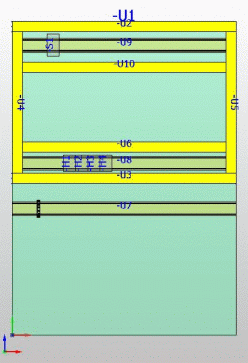

# Показать маршрут

Функция Показать маршрут означает выделение текущей сети соединенных сегментов. Маршрут может отображаться полностью или с ограничениями, настроенными в используемом фильтре соединений.

1. Выберите пункты меню Вид > Соединения > Показать маршрут.

!!! info "Для сведения:"

    Отобразится маршрут. Будут выделены все каналы, трассы маршрутизации, соединительные отверстия для проводов и сегменты маршрутизации, через которые может проходить соединение.

!!! info "Для сведения:"

    Прозрачность всех размещений изделий в пространстве листа будет настроена на 50 %. Чтобы кабельные каналы и области маршрутизации, участвующие в образовании текущей сети соединенных сегментов, были лучше видны, на них не распространяется повышение прозрачности. Автоматические сегменты маршрутизации не выделяются.

### Фильтр соединений для отображения маршрута

В фильтре соединений для отображения маршрута можно настроить критерии представления маршрута. Области маршрутизации, соответствующие установленным критериям, будут выделены. Области маршрутизации, не соответствующие установленным критериям, будут отображаться прозрачно.

1. Выберите пункты меню Вид > Соединения > Фильтр.

!!! info "Для сведения:"

    Откроется диалоговое окно Фильтр соединений.

2. Активируйте или деактивируйте нужные критерии.
3. Щелкните по кнопке ++OK++.

!!! info "Для сведения:"

    Все каналы, трассы маршрутизации, соединительные отверстия для проводов и сегменты маршрутизации, через которые может проходить соединение, будут выделены, если они соответствуют как минимум одному из установленных критериев. Трассы, для которых не установлены критерии, будут отображены прозрачно.

**См. также:**

* [Вкладка Фильтр соединений](connectionsettingsgui_r_einstellungenverbindungsfilter.md)
