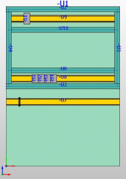

# Генерировать сеть соединенных сегментов

Графические объекты в пространстве листа служат основой для создания сети соединенных сегментов, в которой маршрутизируется соединение. При этом кабельным каналам автоматически присваиваются сегменты маршрутизации. Чтобы между кабельными каналами было найдено соединение, они не обязательно должно быть размещены на расстоянии 0 друг к другу. С помощью настройки проекта Допустимое расстояние между кабельными каналами (под категорией Соединения > Маршрутизируемые соединения, регистрирующая карта Маршрутизация) можно определить допуск на расстояние, который перекрывается при маршрутизации между кабельными каналами.

Добавив подходящие сегменты маршрутизации, можно расширить сеть соединенных сегментов или соединить между собой несколько отдельных областей, например монтажную плату и дверь. После изменения пути сегментов маршрутизации необходимо заново создать сеть соединенных сегментов.

Условие:

Вы открыли проект. Открыто одно пространство листа. В пространстве листа или навигаторе пространства листа выбраны объекты.

1. Выберите пункты меню Данные проекта > Соединения > Генерировать сеть соединенных сегментов.

!!! info "Для сведения:"

    Через каждый кабельный канал прокладывается автоматический сегмент маршрутизации.

!!! info "Для сведения:"

    Сегменты маршрутизации кабельных каналов, размещенных рядом друг с другом, соединяются. Открытым концам каналов присваивается поперечный сегмент маршрутизации, чтобы в них можно было поместить соединения.

!!! info "Для сведения:"

    Области маршрутизации размещаются без сегментов маршрутизации целиком в качестве части сети соединенных сегментов.

!!! info "Для сведения:"

    Информация обо всех сегментах маршрутизации, найденных в пространстве листа (геометрическая длина, направление, предшествующий сегмент, следующий сегмент), собирается и объединяется в сеть соединенных сегментов. Эта сеть служит информационной основой при расчете трассы маршрутизации.

!!! note "Замечание:"

    При создании сети соединенных сегментов генерируется полный отчет об открытом пространстве листа. Можно также выделить в навигаторе пространства листа несколько пространств листа, чтобы сгенерировать общий отчет. При этом для каждого пространства листа рассчитывается отдельная сеть соединенных сегментов, поэтому маршрутизация из одного пространства листа в другое невозможна.

**См. также:**

* [Вкладка Маршрутизация](connectionsettingsgui_r_einstellungenverlegung.md)
* [Удалить автоматические сегменты маршрутизации](routinggui_h_autostreckenloeschen.md)
* [Показать маршрут](routinggui_h_streckenansicht.md)
