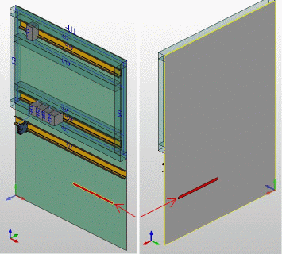

# Вставить и изменить соединительные отверстия для проводов

Соединительные отверстия для проводов служат для того, чтобы при маршрутизации направлять соединения на обратную сторону монтажных плат, разделительных пластин или других функциональных элементов электрошкафа. При маршрутизации используются автоматические сегменты маршрутизации, возникающие при генерировании сети соединенных сегментов между размещениями изделий и соединительным отверстием для проводов.

* Размещение соединительных отверстий для проводов подобно размещению заблокированных областей.
* Соединительные отверстия для проводов вставляются в пространство листа в форме прямоугольных параллелепипедов.
* Соединительные отверстия для проводов имеют свойство Дополнительная длина. Если значение этого свойства на соединительном отверстии для проводов пусто, используется значение из настройки проекта Дополнительная длина соединительных отверстий для проводов (в категории Маршрутизируемые соединения > Общее, вкладка Маршрутизация). При маршрутизации дополнительная длина прибавляется каждому проходящему соединению.
* Соединительные отверстия для проводов содержат только один сегмент маршрутизации. Следовательно, через них могут проходить только соединения, направленные в одну сторону.
* Края соединительного отверстия для проводов можно использовать как начальную или конечную точку сегмента маршрутизации или кривой. В этом случае маршрутизация соединений также выполняется через соединительное отверстие для проводов. При этом маршрутизацию через соединительное отверстие для проводов можно запустить также, вручную задав трассы маршрутизации по умолчанию.

1. Выберите пункты меню Вставить > Соединительное отверстие для проводов.

!!! info "Для сведения:"

    В строке состояния отобразится требование: "Начальная точка соединительного отверстия для проводов".

!!! info "Для сведения:"

    При определении начальной и конечной точек можно вызвать пункт всплывающего меню Опции размещения и использовать относительный ввод координат.

2. Разместите начальную точку соединительного отверстия для проводов на активированной поверхности монтажной платы.

!!! info "Для сведения:"

    В строке состояния отобразится требование: 'Конечная точка соединительного отверстия для проводов'.

3. Вытяните соединительное отверстие для проводов, как прямоугольник, в нужном направлении.
4. Произвольно разместите конечную точку или захватите еще одну точку.

!!! info "Для сведения:"

    Соединительное отверстие для проводов вставляется в функциональный элемент в виде прямоугольного параллелепипеда.

### Изменить размер соединительных отверстий для проводов

Размер соединительных отверстий для проводов можно изменить двумя способами:

* ***Изменение свойств формата в диалоговом окне 'Свойства'***: на вкладке Формат в диалоговом окне 'Свойства' введите измененные значения в поля Ширина и Высота. Изменение производится относительно нижней левой угловой точки.
* ***Графическое изменение***: выделите объект. На угловых точках и в центре боковых линий отображаются указатели в виде стрелок в направлении, в котором можно растянуть или сжать объект. При перемещении вдоль указателя на соседних объектах 3D отображаются точки захвата, которые можно использовать для точного позиционирования.

**См. также:**

* [Генерировать сеть соединенных сегментов](routinggui_h_streckennetzerzeugen.md)
* [Вкладка Маршрутизация](connectionsettingsgui_r_einstellungenverlegung.md)
