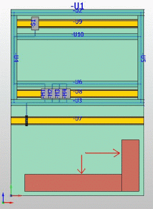
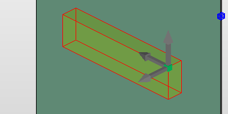
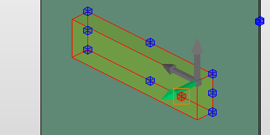
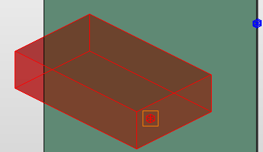

# Вставить и изменить области маршрутизации

Области маршрутизации являются элементами сети соединенных сегментов. Соединения в областях маршрутизации не проходят по ходу сегмента маршрутизации: маршрутизация всегда выполняется посредством максимально короткого, прямого соединения. За счет этого можно, например, выполнить разводку на задней стороне монтажной платы.

* Размещение областей маршрутизации подобно размещению заблокированных областей.
* Создается прямоугольный параллелепипед с прозрачным представлением.
* Функциональные элементы не должны находиться в области маршрутизации или вторгаться в нее, так как это не предусмотрено маршрутизацией. За это условие отвечает контрольный прогон ([P026036](msg/messages_p_026036.md)).
* Области маршрутизации, размещенные рядом друг с другом, не соединяются между собой автоматически. Соединение необходимо устанавливать вручную при помощи создаваемых вручную сегментов маршрутизации, заканчивающихся на краях области.

1. Выберите пункты меню Вставить > Область маршрутизации.

!!! info "Для сведения:"

    В строке состояния отобразится требование: "Начальная точка области маршрутизации".

!!! info "Для сведения:"

    При определении начальной и конечной точек можно вызвать пункт всплывающего меню Опции размещения и использовать относительный ввод координат.

2. Разместите начальную точку области маршрутизации на активированной поверхности.

!!! info "Для сведения:"

    В строке состояния отобразится требование: 'Конечная точка области маршрутизации'.

3. Вытяните область маршрутизации, как прямоугольник, в нужном направлении.
4. Произвольно разместите конечную точку или захватите еще одну точку.

!!! info "Для сведения:"

    Область маршрутизации вставляется на активированную поверхность в качестве прозрачного прямоугольного параллелепипеда.

Чтобы изменить размер областей маршрутизации, в диалоговом окне 'Свойства' на вкладке Формат введите измененные значения параметров Ширина, Высота и Глубина. Изменение производится относительно нижней левой угловой точки.

Графическое изменение размеров в областях маршрутизации возможно с помощью функции Обработка > Графика > Изменить длину. Графическое изменение возможно для одного из трех измерений.

Условия:

* Вы открыли проект.
* Навигатор пространства листа открыт, и открыто пространство листа.
* Пространство листа содержит как минимум одну область маршрутизации.

1. Выберите пункты меню Обработать > Графика > Изменить длину.
2. Нажмите на объект, который нужно изменить.

!!! info "Для сведения:"

    В четырех угловых точках передней поверхности при наведении курсора отобразится трехмерная система координат.

3. Щелчком мыши выберите нужную ось и, таким образом, размер, который нужно изменить.

!!! info "Для сведения:"

    Ось, в направлении которой можно изменить размер, отображается зеленым цветом.

4. После установки направления изменения растяните трехмерный объект в требуемом направлении. Можно использовать следующие формы ввода:

* Свободный ввод точки посредством щелчка клавиши мыши

* Использование точки захвата или точки проекции на другом объекте

* Использование точек сетки

* Ввод положительного или отрицательного значения в область ввода данных.

!!! info "Для сведения:"

    После изменения новые размеры отображаются в диалоговом окне 'Свойства' на вкладке Формат.

**См. также:**

* [Генерировать сеть соединенных сегментов](routinggui_h_streckennetzerzeugen.md)
