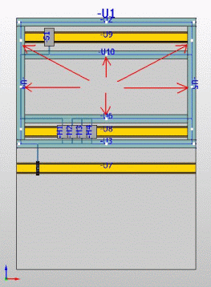

# Изменить маршрутизацию

Трассу маршрутизации, определенную при маршрутизации соединения, можно изменять.

* Маршрутизируемые соединения можно перекладывать с одного сегмента маршрутизации на другой.
* Немаршрутизированные соединения можно прокладывать по сегменту маршрутизации, в результате чего из них получаются маршрутизированные соединения.

Свойство соединения Пространство листа: Трасса маршрутизации — по умолчанию заполняется в зависимости от изменения маршрутизации. После этого при маршрутизации этих соединений фильтры соединений не учитываются.

При изменении маршрутизации используйте ***Точки модификации***. Эти точки указываются при изменении маршрутизации вручную. Путем перемещения точки модификации в другую точку можно изменить трассу маршрутизации соединений. Если через сегмент маршрутизации или канал проходят несколько соединений, на экран выводится диалоговое окно выбора, в котором вы указываете, какое из этих соединений необходимо перенести на новый сегмент маршрутизации / новый канал. Тогда сегменты маршрутизации и области маршрутизации записываются на выбранных соединениях в свойство Пространство листа: Трасса маршрутизации — по умолчанию.

1. Выберите пункты меню Данные проекта > Соединения > Изменить маршрутизацию.

!!! info "Для сведения:"

    На ручных и автоматических сегментах маршрутизации, а также на видимых немаршрутизированных соединениях появятся точки модификации в форме прямоугольных параллелепипедов. В центре каждой области маршрутизации появится точка модификации.

!!! info "Для сведения:"

    В строке состояния отобразится требование: "Выбрать сегмент маршрутизации источника".

2. Переместите курсор к какой-нибудь точке, принадлежащей тому сегменту, который вы хотите удалить из трассы маршрутизации.

!!! info "Для сведения:"

    Вокруг точки модификации появится красный квадрат в виде точки захвата.

3. Щелчком мыши выберите точку захвата.

!!! info "Для сведения:"

    В строке состояния отобразится требование: "Выбрать сегмент маршрутизации цели".

!!! tip "Совет:"

    При изменении ***шланговых соединений*** при помощи функции Изменить маршрутизацию можно также выбрать несколько исходных и целевых сегментов маршрутизации. При этом выбор нескольких сегментов маршрутизации источника осуществляется путем нажатия клавиши пробела.

4. Переместите курсор к какой-нибудь точке, принадлежащей тому сегменту, через который вы хотите заново маршрутизировать соединение.

!!! info "Для сведения:"

    Между точкой сегмента модификации источника, выбранной вначале, и курсором появится белая линия.

5. Щелчком мыши выберите одну из точек сегмента модификации цели.

!!! info "Для сведения:"

    Отобразится диалоговое окно Соединения, в котором перечислены все соединения, проходящие через сегмент маршрутизации источника. Отображенные соединения уже выделены в диалоговом окне.

!!! tip "Совет:"

    При изменении маршрутизации следите за тем, чтобы данные трассы маршрутизации содержали все сегменты маршрутизации нового профиля. В частности, это важно в случае со свободно маршрутизированными кабелями, т. к. из-за неполных данных трассы маршрутизации (напр., только сегменты маршрутизации до и после изменения направления) длина кабелей может оказаться больше.

6. Установите флажок в столбце Изменить маршрутизацию у тех соединений, которые вы хотите заново маршрутизировать в выбранном сегменте маршрутизации цели.
7. Щелкните по кнопке ++OK++.

!!! info "Для сведения:"

    Выбранные соединения будут маршрутизированы заново.

**См. также:**

* [Генерировать маршрутизируемые соединения: Принцип](routinggui_k_prinzip.md)
* [Маршрутизировать соединения](routinggui_h_verlegen.md)
