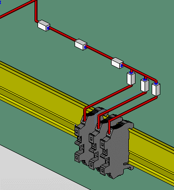
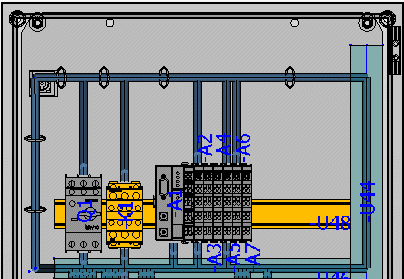
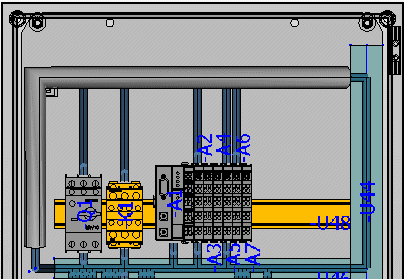

# Принадлежности для маршрутизации: Принцип

Принадлежности для маршрутизации используются для закрепления, объединения и защиты кабелей и шланговых соединений. К трем типам принадлежностей относятся изделия со следующими определениями функций:

* Крепление кабеля / шланга
* Хомут для кабеля / шланга
* Защита кабеля / шланга

Вставка изделий осуществляется при помощи пунктов меню Вставить > Принадлежности для маршрутизации. При размещении принадлежности для маршрутизации доступны все стандартные опции пространства листа и диалоговое окно Опции размещения.

Крепление кабеля / шланга

Принадлежности для маршрутизации для крепления шлангов, кабелей и отдельных жил больших сечений; на практике используются, например, как зажимы для кабелей или шлангов.

График принадлежности для маршрутизации "Крепление кабеля/шланга" можно представить с помощью присвоенного изделию трехмерного графического макроса или сгенерировать по размерам изделия. В первом случае макрос должен содержать сегмент маршрутизации, во втором случае этот сегмент генерируется автоматически.

Изделие можно разместить на монтажной поверхности.

!!! note "Замечание:"

    Чтобы провести соединение через уже размещенное крепление для кабеля / шланга, необходимо маршрутизировать соединение с помощью функции Изменить маршрутизацию через крепление как целевой сегмент маршрутизации.

Хомут для кабеля / шланга

Принадлежности для маршрутизации для объединения шлангов, кабелей и отдельных жил в жгут.

При создании изделия на вкладке Данные маршрутизируемой принадлежности значения свойств изделия Минимальный диаметр жгута и Максимальный диаметр жгута записываются в соответствии с указаниями производителя. Диаметр жгута определяет минимальный или максимальный диаметр связки соединений для объединения с этим изделием.

Для правильного расчета диаметра жгута на вкладке Данные соединения для изделия соединения необходимо определить внешний диаметр (с указанием единицы измерения).

Принадлежность для маршрутизации "Хомут для кабеля/шланга" объединяет соединения, маршрутизированные в одном сегменте маршрутизации или в одной кривой. Изделие можно разместить в любом месте сегмента маршрутизации или кривой. После размещения хомут для кабеля / шланга концентрическим кольцом охватывает сегмент маршрутизации или кривую.

Защита кабеля / шланга

Принадлежности для маршрутизации для защиты объединенных шлангов, кабелей и отдельных жил от механических и термических внешних воздействий; на практике используются, например, спиральные шланги.

При создании изделия на вкладке Данные маршрутизируемой принадлежности значения свойств изделия Минимальный диаметр жгута и Максимальный диаметр жгута записываются в соответствии с указаниями производителя.

Для правильного расчета диаметра жгута на вкладке Данные соединения для изделия соединения необходимо определить внешний диаметр (с указанием единицы измерения).

Принадлежность для маршрутизации "Защита кабеля/шланга" объединяет соединения, маршрутизированные в одном сегменте маршрутизации или в одной кривой. Изделие можно разместить в любом месте сегмента маршрутизации или кривой. Изделие размещается путем ввода начальной и конечной точки на одном или нескольких связанных сегментах маршрутизации или кривых. После размещения защита кабеля / шланга концентрическим кольцом охватывает сегмент маршрутизации или кривую.

