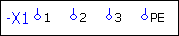
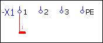
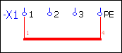
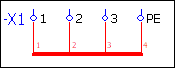
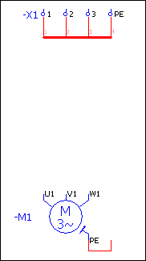
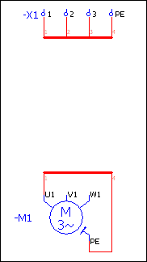
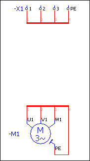
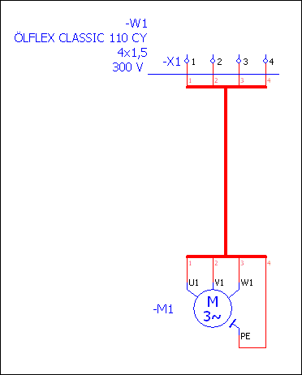

# Представление кабелей с помощью выводов жгута

EPLAN позволяет получить более наглядное представление кабелей с помощью выводов жгутов. Перед источником кабеля его кабельные соединения переходят в кабельный жгут в виде символов выводов жгута.

Рядом с целью кабеля жгут снова расходится в виде символов выводов жгута, а отдельные кабельные соединения кабеля проводятся дальше в развернутой (многополюсной) форме. Ниже на конкретном примере показаны все этапы создания такого кабельного представления со жгутами. При этом через кабельный жгут к двигателю должен быть подключен клеммник.

Условия:

* Вы открыли проект.
* Проект содержит новую многополюсную страницу схемы соединений.
* Страница схемы соединений открыта в графическом редакторе.

В первом шаге вставляется источник кабеля, который должен состоять из клеммника с четырьмя расположенными рядом простыми клеммами. Затем необходимо начертить выводы жгута, которые переходят из клеммника в кабельный жгут.

1. С помощью Выбор символа вставьте клеммник в страницу схемы соединений и поместите его в любом месте в верхней части страницы.
2. Начертите клеммник, используя "-X1", а также клеммы одну за другой, используя "1", "2", "3" и "PE".

3. Выберите пункты меню Вставить > Вывод жгута > Угол.

!!! info "Для сведения:"

    Вывод жгута типа "Угол" прикрепляется к курсору.

4. Нажмите клавишу ++Ctrl++ и удерживайте ее нажатой.

!!! info "Для сведения:"

    Теперь с помощью круговых движений мыши можно настроить требуемый вариант угла.

5. Поверните мышь таким образом, чтобы тонкий вывод указывал вверх, а толстый (вывод жгута) - вправо.
6. Отпустите клавишу ++Ctrl++ и переместите угол в направлении клеммы 1 таким образом, чтобы произошло автоматическое соединение клеммы с углом.
7. Щелкните левой кнопкой мыши.

!!! info "Для сведения:"

    Откроется диалоговое окно Свойства ++...++.

8. Введите в поле Вывод жгута, введите в поле Обозначение вывода жгута "1" и укажите, если требуется, Описание вывода жгута.
9. При необходимости выберите вкладку Отображение, чтобы задать настройки отображения для вывода жгута.
10. Щелкните по кнопке ++OK++.

!!! info "Для сведения:"

    Диалоговое окно Свойства ++...++ закроется. Угол вставляется в схему соединений под клеммой 1.

11. Повторите эти операции для другого вывода жгута типа "Угол" и вставьте его на той же высоте под клеммой PE / PEN таким образом, чтобы тонкий вывод указывал вверх, а толстый — влево.
12. В качестве Обозначения вывода жгута введите "4".

!!! info "Для сведения:"

    Выполняется автоматическое соединение угла с клеммой PE / PEN. Далее толстые выводы углов объединяются в жгут.

13. Выберите пункты меню Вставить > Вывод жгута > Тройник.
14. Поверните тройник таким образом, чтобы тонкий вывод указывал вверх, а толстые выводы находились внизу.
15. Вставьте тройник под клеммой 2 и введите в поле Обозначение вывода жгута цифру "2".
16. Таким же образом вставьте еще один тройник и укажите в качестве обозначения цифру "3".

!!! info "Для сведения:"

    В результате получена следующая схема:

Во втором шаге вставляется цель кабеля, которая должна состоять из трехфазного AC двигателя с четырьмя выводами (включая PE / PEN). Затем необходимо начертить выводы жгута, которые выходят из кабельного жгута и ведут к двигателю.

1. Вставьте в схему соединений с помощью Выбор символа двигатель с PE / PEN и четырьмя выводами (имя "M3", номер символа "62") и разместите его на достаточном расстоянии под уже начерченным клеммником.
2. Введите в качестве обозначения устройства "-M1".
3. Вставьте для вывода PE / PEN двигателя "стандартный" Угол вверху справа и добавьте к нему Угол вверху слева.
4. Разместите двигатель таким образом, чтобы клеммник с выводами жгутов и выводы двигателя находились на одной линии.

!!! info "Для сведения:"

    В результате получается следующая схема:

5. Выберите пункты меню Вставить > Вывод жгута > Угол.
6. Разместите угол на небольшом расстоянии над выводом двигателя U1 и поверните его таким образом, чтобы тонкий вывод указывал вниз, а толстый (вывод жгута) - вправо.

!!! info "Для сведения:"

    При этом выполняется автоматическое соединение вывода жгута с выводом двигателя U1.

7. Щелкните левой кнопкой мыши.

!!! info "Для сведения:"

    Откроется диалоговое окно Свойства ++...++.

8. Введите в поле Вывод жгута, введите в поле Обозначение вывода жгута "1" и укажите, если требуется, Описание вывода жгута.
9. При необходимости выберите вкладку Отображение, чтобы задать настройки отображения для вывода жгута.
10. Щелкните по кнопке ++OK++.

!!! info "Для сведения:"

    Диалоговое окно Свойства ++...++ закроется. Угол вставляется в схему соединений над клеммой U1.

11. Повторите эти операции для другого вывода жгута типа "Угол" и вставьте его на той же высоте над удлиненным выводом PE / PEN таким образом, чтобы тонкий вывод указывал вниз, а толстый — влево.
12. В качестве Обозначения вывода жгута введите "4".

!!! info "Для сведения:"

    Выполняется автоматическое соединение угла с выводом PE / PEN. Далее толстые выводы обоих вставленных углов объединяются в жгут.

13. Выберите пункты меню Вставить > Вывод жгута > Тройник.
14. Поверните тройник таким образом, чтобы тонкий вывод указывал вниз, а толстые выводы находились вверху.
15. Вставьте тройник над выводом двигателя V1 и введите в поле Обозначение вывода жгута цифру "2".
16. Таким же образом вставьте еще один тройник под выводом двигателя W1 и укажите в качестве обозначения цифру "3".

!!! info "Для сведения:"

    В результате получена следующая схема:

В третьем шаге выполняется соединение этих двух групп выводов жгута с помощью соответствующих символов.

1. Выберите пункты меню Вставить > Вывод жгута > Распределитель, тройник.
2. Вставьте символ между выводами жгута 2 и 3 клеммника.
3. Вставьте другой тройник-распределитель, повернув его на 180°, между выводами жгута 2 и 3 двигателя.

!!! info "Для сведения:"

    Между тройниками-распределителями образуется толстая линия автоматического соединения, т. е. ***Жгут***.

4. Затем вставьте линию определения кабеля и протяните ее над всеми линиями автоматического соединения между выводами жгутов и клеммником.
5. Введите ОУ кабеля "-W1" и при необходимости присвойте кабелю другие свойства.

!!! info "Для сведения:"

    В результате получается следующая схема:

**См. также:**

* [Особенности при использовании кабелей в однополюсном представлении](singlepole_k_besonderheitenkabel.md)
* [Жгутовое представление соединений в схемах соединений](singlepole_k_straenge_in_einpoligerdarstellung.md)
* [Вкладка Вывод жгута](devicetaggui_r_stranganschluss.md)
