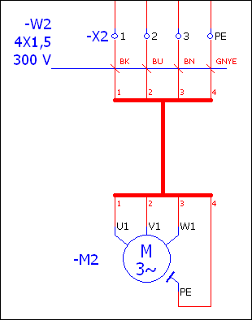
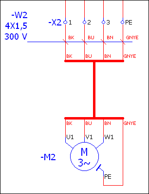

# Применить цвета/номера кабельных соединений в качестве обозначений выводов жгута

С помощью пункта меню Перезаписать выводы жгутов в случае кабельных соединений можно перезаписывать обозначения выводов жгутов с помощью цветов или номеров соединений кабеля. Тем самым в случае очень длинных жгутов, которые нередко с помощью точек прерывания проходят через несколько страниц, обозначения соединений можно прочитать и в начале, и в конце кабеля. Кроме того, при поиске ошибок в схеме соединений также значительно облегчается отслеживание кабельного соединения в виде жгута между целью и источником кабеля.

Условия:

* Вы открыли проект.
* Проект содержит многополюсную страницу схемы соединений с кабельным соединением, которое, как отображено в примере ниже, представлено в виде жгута. Линия определения кабеля проходит в многополюсной области кабеля между источником кабеля и входящими в жгут символами выводов жгута. Точки определения соединения для кабеля обозначены цветами или номерами.
* Страница схемы соединений открыта в графическом редакторе.

1. Выделите линию определения кабеля.
2. Выберите пункты меню Данные проекта > Кабель > Перезаписать выводы жгутов.

!!! info "Для сведения:"

    Обозначения выводов жгутов 1, 2, 3 и 4 на обоих концах жгута заменяются цветами соединений кабеля BK, BU, BN и GNYE.

**См. также:**

* [Особенности при использовании кабелей в однополюсном представлении](singlepole_k_besonderheitenkabel.md)
* [Жгутовое представление соединений в схемах соединений](singlepole_k_straenge_in_einpoligerdarstellung.md)
