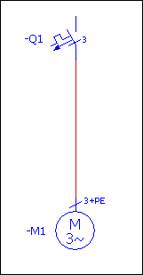
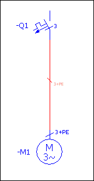

# Начертить схему соединений в однополюсном представлении

Ниже даются пояснения по созданию простой однополюсной схемы соединений. Сначала к проекту следует добавить однополюсную страницу схемы соединений. После этого на ней размещаются два символа (автомат защиты двигателя и трехфазный двигатель), связанные друг с другом с помощью автоматического соединения. Появившееся соединение обозначается посредством точки определения соединения.

Условия:

* Вы открыли проект.
* У вас имеется доступ к однополюсной библиотеке символов.

### Создание страницы для однополюсного представления

1. Выберите Страница > Создать.
2. В диалоговом окне Новая страница из раскрывающегося списка Тип страницы выберите запись "Однополюсн. схема соединений (I)" и нажмите ++OK++.

!!! info "Для сведения:"

    EPLAN создает страницу типа Однополюсная схема соединений и открывает ее в графическом редакторе.

### Вставить символы

1. Выберите Вставить > Символ.
2. В диалоговом окне Выбор символа из раскрывающегося списка Фильтр выберите запись "Однополюс. символы IEC".

!!! info "Для сведения:"

    Теперь для выбора предлагаются только однополюсные символы.

3. Выберите вкладку Список.
4. Введите в поле Прямой ввод символьную строку "ql3".
5. В списке выбора символов нажмите на заголовок столбца Имя, чтобы имена символов отображались по нарастающей.
6. Выделите символ QL3 с номером 124. В данном случае это однополюсный автомат защиты двигателя с 6 выводами. Справа выводится предварительный просмотр всех доступных вариантов выбранного символа.
7. Выделите в предварительном просмотре слева вверху первый вариант символа и щелкните по ++OK++.
8. Разместите символ на однополюсной странице схемы соединений в графическом редакторе и оставьте в диалоговом окне Свойства ++...++ предварительно заданное обозначение устройства -Q1, а также обозначение вывода устройства.
9. Вставьте через диалоговое окно Выбор символа другой символ в схему соединений, только в этот раз символ M3 под номером 62.
10. Разместите на схеме соединений трехфазный двигатель с выводом PE / PEN в виде варианта А под автоматом защиты двигателя -Q1 таким образом, чтобы оба условных обозначения были связаны линией автоматического соединения.
11. Оставьте предложенное обозначение устройства -M1 и обозначение вывода двигателя.

!!! info "Для сведения:"

    В результате получается следующая схема:

### Размещение точки определения соединения

Для представления соединения в виде трех жил необходимо разместить на линии автоматического соединения точку определения соединения.

1. Выберите Вставить > Точка определения соединения.
2. Разместите точку определения соединения на линии автоматического соединения между обоими нужными символами в схеме соединений.
3. В диалоговом окне Свойства ++...++ перейдите на вкладку Данные символа / функции, в поле Вид представления выберите запись "Однополюс." и щелкните мышью по Применить.
4. Вернитесь на вкладку Точка определения соединения.

!!! info "Для сведения:"

    В списке Свойства отображается свойство Число функций. В противном случае дополните список при помощи кнопки {: .ui-icon } (Создать), введя это свойство.

5. Также введите это свойство в список вкладки Отображение, чтобы введенное значение выводилось в схеме соединений у точки определения соединения.
6. Перейдите на вкладку Точка определения соединения и введите в поле Число функций значение "3+PE".
7. Примените введенные данные в диалоговом окне Свойства ++...++, нажав кнопку ++OK++.

!!! info "Для сведения:"

    В результате получается следующая схема:

**См. также:**

* [Однополюсное представление: Принцип](singlepole_k_hintergrund.md)
