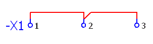

# Создание перемычек

Перемычки можно создать различными способами. Перемычку в точке определения соединения Вы создаете вручную, задавая там тип перемычки соединения. Так, например, Вы можете определить вставную или проволочную перемычку.

Можно также определить, должны ли между клеммами клеммника использоваться ***Проволочные перемычки*** или ***Мостовые перемычки***. Мостовые перемычки также можно создать автоматически.

Условия:

* Вы открыли проект.
* На странице схемы соединений проекта определен клеммник и вставлено несколько находящихся рядом друг с другом клемм, которые имеют ОУ клеммника и носят различные обозначения.

Ниже различные возможности по созданию перемычек разъясняются на примере. На странице схемы соединений с помощью двух углов и тройника между собой связаны три клеммы.

### Указать перемычку с помощью определения соединения

1. Выберите пункты меню Данные проекта > Соединения > Навигатор.
2. В диалоговом окне Соединения — <Имя проекта> выделите соединение между первой и второй клеммой.
3. Выберите пункт всплывающего меню Свойства.
4. В диалоговом окне Свойства ++...++, вкладка Соединение, рядом с полем Определение функции щелкните по ++...++.
5. В развернутом дереве диалогового окна Определения функций выделите определение соединения "Вставная перемычка".
6. Щелкните по кнопке ++OK++.
7. Выделите в навигаторе соединений соединение между второй и третьей клеммами и в этот раз выберите "Проволочная перемычка" как определение соединения.
8. Щелкните по кнопке ++OK++.

!!! info "Для сведения:"

    В схеме соединений для этого соединения также предусмотрена точка определения соединения.

9. Выделите первую клемму на схеме соединений и выберите пункты меню Данные проекта > Клеммники > Обработать.

!!! info "Для сведения:"

    В диалоговом окне Обработать клеммник графика перемычек представлена красным цветом. В столбце Мостовые перемычки (внутр.) между первой и второй клеммами представлена ***мостовая перемычка***, а в столбце Перемычки (внутр.) между второй и третьей клеммами представлена ***проволочная перемычка***.

### Соединить клеммы посредством проволочных перемычек

1. Выделите первую клемму клеммника и в диалоговом окне Свойства ++...++ выберите вкладку Клемма.
2. Из раскрывающегося списка Мостовая перемычка выберите запись "Без автоматических перемычек".
3. Щелкните по кнопке ++OK++.
4. Повторите настройку для второй и третьей клемм с одинаковой записью.
5. Выделите первую клемму на схеме соединений и выберите пункты меню Данные проекта > Клеммники > Обработать.

!!! info "Для сведения:"

    В диалоговом окне Обработать клеммник в столбце Перемычки (внутр.) представлена красным цветом графика перемычек, которая соединяет три клеммы выбранного клеммника.

### Соединить клеммы посредством мостовых перемычек

1. Выделите первую клемму клеммника и в диалоговом окне Свойства ++...++ выберите вкладку Клемма.
2. Выберите запись из раскрывающегося списка Мостовая перемычка запись "Автоматич.". (Эта запись устанавливается по умолчанию.)
3. Щелкните по кнопке ++OK++.
4. Повторите настройку для второй и третьей клемм с одинаковой записью.
5. Выделите первую клемму на схеме соединений и выберите пункты меню Данные проекта > Клеммники > Обработать.

!!! info "Для сведения:"

    В диалоговом окне Обработать клеммник в столбце Мостовые перемычки (внутр.) представлена красным цветом графика перемычек, которая соединяет три клеммы выбранного клеммника.

!!! tip "Совет:"

    В диалоговом окне Обработать клеммник с помощью специальных кнопок можно генерировать или удалять [вручную созданные мостовые перемычки](terminalgui_k_verwendungbruecken.md). Мостовые перемычки можно отдельно генерировать для внутренних и внешних выводов мостовых перемычек.

### Соединить клеммы посредством переключаемых перемычек

Переключаемая перемычка соединяет клемму со ***следующей*** клеммой с возможностью переключения. Используя свойства Переключаемая перемычка (внешняя) и Переключаемая перемычка (внутренняя), можно отдельно определить переключаемые перемычки для внутренней и внешней стороны клеммы. На следующем примере показано, как создаются внешние переключаемые перемычки.

1. Выделите первую клемму клеммника и в диалоговом окне Свойства ++...++ выберите вкладку Клемма.
2. Выберите в списке свойств свойство Переключаемая перемычка (внешняя) и выберите в столбце Значение запись "замкнута" из раскрывающегося списка. (Если это свойство еще отсутствует в списке, необходимо добавить его при помощи кнопки {: .ui-icon } (Создать) .)
3. Щелкните по кнопке ++OK++.

!!! info "Для сведения:"

    Генерируется внешняя переключаемая перемычка между первой и второй клеммами.

4. Повторите настройку для второй клеммы с той же записью.

!!! info "Для сведения:"

    Генерируется внешняя переключаемая перемычка между второй и третьей клеммами.

5. Выделите первую клемму на схеме соединений и выберите пункты меню Данные проекта > Клеммники > Обработать.

!!! info "Для сведения:"

    В диалоговом окне Обработать клеммник в столбце Переключаемая перемычка (внешняя) отображается настроенное значение для переключаемых перемычек.

**См. также:**

* [Вкладка Соединения](devicetaggui_r_verbindungenklemmen.md)
* [Управление перемычками](terminalgui_k_verwendungbruecken.md)
