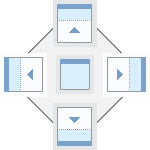
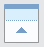
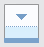
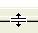
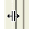

# Диалоговые окна

В диалоговых окнах можно выполнять и изменять настройки, сортировать данные, выполнять команды и операции, управлять данными, обрабатывать свойства и многое другое.

В зависимости от функциональности и назначения программы диалоговые окна содержат различные элементы управления. Далее вы найдете подробную информацию о различных типах диалоговых окон.

Навигатор страниц, навигаторы для устройств, управление слоями и управление сообщениями являются "присоединяемыми" диалоговыми окнами. Это означает, что эти диалоговые окна, как и строки меню и панели инструментов, можно располагать в главном окне EPLAN или за его пределами по своему усмотрению.

Внутри главного окна вы можете присоединить такие диалоговые окна к верхнему, левому, нижнему или правому краю окна, а также к другим присоединяемым элементам.

Кроме того, все навигаторы, предварительный просмотр графики, открытые страницы проекта, формы и т. д. можно присоединить как вкладку. Размещенные друг над другом в качестве вкладок окна образуют оптическую единицу — так называемую ***группу вкладок***.

#### Графическая поддержка во время присоединения

При перемещении присоединяемых окон (навигаторов, предварительного просмотра графики, страниц) отображается большее количество присоединяемых элементов. Вы можете пользоваться этими элементами интерфейса, чтобы установить позицию присоединения такого окна:

Присоединяемый элемент |  Значение
---|---
 |  Присоединить сбоку к группе вкладок или как вкладку группы вкладок.
 |  Присоединить к левой области группы вкладок или главного окна EPLAN.
 |  Присоединить к правой области группы вкладок или главного окна EPLAN.
 |  Присоединить к верхней области группы вкладок или главного окна EPLAN.
 |  Присоединить к нижней области группы вкладок или главного окна EPLAN.

Если окно перемещается на присоединяемый элемент, предварительно выбранная позиция выделяется цветом (синим).

Эти окна могут указывать на определенные ошибки или возможности настройки, а также являться предупреждающими сообщениями, требующими подтверждения пользователя. Размер этих окон не изменяется.

Так называемые "Навигаторы" предлагают особый ракурс данных проекта. В навигаторе отображаются все данные, касающиеся данного объекта, которые содержатся в одном или в нескольких проектах. Так, в навигаторе устройств представлен обзор всех устройств, а в навигаторе клеммников отображаются все клеммы и клеммники открытого проекта.

#### Представление в виде дерева или списка

Данные в диалоговом окне навигатора можно просматривать, воспользовавшись одной из двух вкладок:Дерево или Список. Древовидное представление предполагает отображение объектов в виде иерархии, а представление в виде списка — в алфавитно-числовом порядке.

С помощью фильтра вы можете определить данные, которые будут выводиться на экран для обоих способов отображения.

#### Функция памяти

Навигаторы и многие диалоговые окна "Свойства" имеют "память", т. е. при повторном вызове окна в нем отобразится информация (если таковая имеется), которая была актуальна во время последней обработки. Если закрыть диалоговое окно навигатора, когда вкладка Список находится на переднем плане, при повторном вызове оно снова откроется на этой вкладке и перейдет на строку, которая прежде была выделена для обработки. Если это невозможно (из-за изменения последовательности внутри списка или переименования или удаления выделенного до закрытия объекта), окно перейдет в первую строку. То же правило действует для представления структуры дерева, которое при повторном вызове автоматически покажет ветви, открытые в иерархии последними (если это возможно).

!!! note "Замечание:"

    * Диалоговые окна Выбор символа, База данных изделий и Выбор... подобно навигаторам представляют данные в виде списков или древовидных структур и также обладают памятью.
    * В ***Навигатор страниц*** объекты могут отображаться в виде древа или списка, при этом под "Списком" имеется в виду ***Таблица***. Поэтому управление списками в Навигаторе страниц отличается от использования "обычных" списков в навигаторах.
    * Диалоговые окна для настроек, берущих свое начало в схеме, выбираемой в диалоговом окне, и изменяемых только в единичном случае, не имеют памяти диалогового окна, т. е. при каждом новом вызове диалогового окна настройки берутся в схеме.

Эти диалоговые окна содержат данные, которые могут быть изменены или удалены пользователями со специальными правами. Пользователям, у которых нет таких прав, ввод данных запрещен; они могут только читать содержащиеся здесь данные.

Защита от записи может распространяться на диалоговое окно целиком или только отдельные элементы, например, флажки, источники данных которых имеют защиту от записи. При попытке изменить такие данные система отклонит ввод данных и отобразит сообщение, указывающее на недостаточность ваших прав для внесения каких-либо изменений.

Так называемые "разделители окна" в Windows позволяют менять разделение в диалоговом окне по вертикали или по горизонтали. Это особенно полезно в случаях, когда диалоговое окно состоит из области выбора и области данных, как, например, диалоговое окно Управление проектами.

Разделитель окна можно распознать по измененной форме курсора мыши:

Курсор |  Значение
---|---
 |  Горизонтальное разделение диалогового окна.
 |  Вертикальное разделение диалогового окна.

!!! note "Замечание:"

    * Позиция разделителя окна сохраняется внутри через "память диалогового окна".
    * Относительная позиция разделителя окна меняется по мере изменения размера диалогового окна.
    * Разделитель окна ограничен "областью перемещения", т. е. при вертикальном порядке элементов диалогового окна есть внутреннее ограничение для правого и левого края, а при горизонтальном порядке - для верхнего и нижнего края.

!!! tip "Совет:"

    Прежде чем перемещать разделитель окна, следует сначала определить размер диалогового окна, для которого определяется разделитель.

**См. также:**

* [Элементы интерфейса пользователя](userinterface_k_hintergrund.md)
* [Особенности навигаторов](userinterface_k_besonderheitennavigatoren.md)
