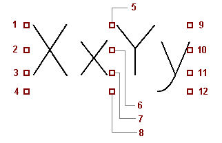

# Вкладка Отображение (Нумерация соединений)

Вы открыли проект.

* Параметры > Настройки > Проекты > "Имя проекта" > Соединения > Нумерация соединений. В диалоговом окне Настройки: Нумерация соединений выберите вкладку Отображение.
* Вы выделили соединения в графическом редакторе или в диалоговом окне навигатора Соединения — <Имя проекта>. Или вы выделили одну или несколько страниц либо проект в диалоговом окне навигатора Страницы — <Имя проекта>. Данные проекта > Соединения > Нумерация > Разместить > [...]. В диалоговом окне Настройки: Нумерация соединений выберите вкладку Отображение.

Определите на этой вкладке форматирование созданных обозначений соединений в точке определения соединения.

Обзор основных элементов диалогового окна:

### Свойство/Присвоение

Для этого существуют уровни иерархии Интервал и Формат, которые открываются после щелчка по символу {: .ui-icon }.

* * *

Уровень иерархии Интервал

### Горизонтально

Здесь задается отступ обозначения соединения от вертикальных частей соединения. Обозначение соединения на вертикальных частях указывается вдоль линии соединения. С помощью этой настройки вы можете перемещать обозначение вперед или назад по горизонтали.

Если обозначение соединения присоединено к другому свойству, то настройка влияет на весь блок.

### Вертикально

Здесь задается отступ обозначения соединения от горизонтальных частей соединения.

* * *

Уровень иерархии Формат

### Выравнивание

Выберите из раскрывающегося списка требуемое выравнивание текста. Выравнивание указывает, где находится точка ввода относительно текста.

1: Вверху слева 2: В центре слева 3: База слева 4: Внизу слева |   |  9: Вверху справа 10: В центре справа 11: База справа 12: Внизу справа
---|---|---
|  5: Вверху по центру 6: В центре по центру 7: База по центру 8: Внизу по центру |

* Спец. слева
* Спец. справа
* Спец. по центру
* JIC спец. слева
* JIC спец. справа
* JIC спец. по центру.

При использовании этих настроек тексты выравниваются так же, как и в EPLAN 5. Тексты перемещаются на 2 мм вниз и, в зависимости от положения текста, на 5 мм по оси X.
Независимо от размера шрифта и угла поворота текст при настройке Спец. слева перемещается на 5 мм влево, а при настройке Спец. справа — на 5 мм вправо.

**См. также:**

* [Диалоговое окно Настройки: Нумерация соединений](wirenumberinggui_d_verbnumeinstellungen.md)
* [Произвести настройки для нумерации соединений](wirenumberinggui_h_einstellungen.md)
