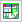

# Разделение проектов на области обработки

Условия:

* Вы открыли проект.
* Вы (или администратор проекта) создали схемы, задающие критерии для разделения на области обработки.

1. Выберите пункты меню Проект> Области обработки > Определить.

!!! info "Для сведения:"

    В диалоговом окне Определить области обработки отображаются схемы, которые уже были созданы для разделения областей обработки.

!!! info "Для сведения:"

    В столбце Все обработчики отображаются другие обработчики, выбравшие область обработки в проекте.

2. Выберите свою область обработки, установив флажок в столбце Моя область обработки для нужной схемы.
3. Если вы хотите периодически вносить изменения в весь проект, установите флажок Временно работать во всем проекте.

!!! info "Для сведения:"

    Область обработки будет временно распространена на весь проект. Это целесообразно, например, при обновлении отчетов.

4. Щелкните по кнопке ++OK++.
5. Выберите пункты меню Проект > Области обработки > Активировать выбранную область обработки.

!!! info "Для сведения:"

    Изменения вносятся только в определенную область обработки. После этого в навигаторах данных проекта будут отображаться только страницы, устройства и т. д., соответствующие критериям, заданным в схеме.

!!! info "Для сведения:"

    Если в проекте активирован выбор областей обработки, в строке заголовка навигаторов перед именем проекта появится знак процента "%" (например, в навигаторе страниц: Страницы — %ESS_Sample_Project).

!!! note "Замечание:"

    * Устройства, клеммники и т. п., которые по структурным идентификаторам не относятся ни к одной структуре проекта, сортируются в навигаторе устройства на уровне структуры дерева "Без структурных идентификаторов". Такие функциональные элементы без структурных идентификаторов можно выбрать для обработки, для чего в схеме для области обработки в качестве критерия фильтрации заносится пустой структурный идентификатор.
    * Если пользователь при обработке проекта задает новый структурный идентификатор, он сразу же готов к использованию в качестве критерия фильтрации, но не заносится автоматически в текущую схему для области обработки.

!!! tip "Совет:"

    Чтобы временно распространить область обработки на весь проект, выберите пункты меню Проект > Области обработки > Весь проект. В качестве альтернативы вы можете щелкнуть мышкой на панели инструментов Стандарт по пиктограмме  (Обрабатывать проект в целом). После окончания операции завершите временную обработку всего проекта, для чего еще раз выберите данный пункт меню (или еще раз щелкните по пиктограмме).

**См. также:**

* [Области обработки](workingsection_k_start.md)
