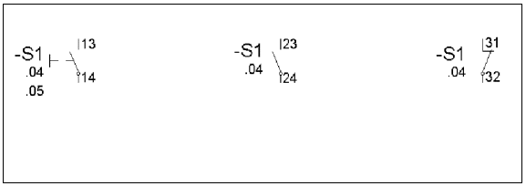
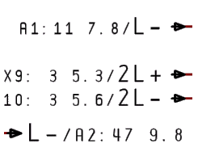

# Перекрестные ссылки: Виды перекрестных ссылок

В системе EPLAN используются такие виды перекрестных ссылок:

### Перекрестные ссылки оборудования

Перекрестные ссылки оборудования различаются следующим образом:

Главная функция указывает на все вспомогательные функции, и каждая вспомогательная функция указывает на главную функцию.

При этом следующая последовательность действует для представления вспомогательных функций в перекрестной ссылке:
Сначала в отображении перекрестной ссылки главной функции представляются вспомогательные функции, заданные на определение устройства. Затем следуют вспомогательные функции, которые вы установили за пределами определения устройства. если во вспомогательные функции внесены обозначения выводов устройства, то сначала отображаются числовые, а затем алфавитно-числовые выводы устройства в перекрестной ссылке главной функции. При алфавитно-числовой сортировке учитывается количество цифр.

#### Перекрестные ссылки оборудования между однополюсным и многополюсным представлениями

Перекрестные ссылки между устройствами возможны тогда, когда вы разместили на страницах схемы соединений однополюсное и многополюсное представления. Для этого система EPLAN через пункты меню Параметры > Настройки > Проекты > "Имя проекта" > Перекрестные ссылки / образ контакта > Отображение должна получить информацию, что между обеими формами представления должны быть сгенерированы и отображены перекрестные ссылки устройства.

!!! note "Замечание:"

    Обратите внимание, что ***парная перекрестная ссылка в однополюсном виде представления*** более невозможна. Вид представления при этом не имеет ничего общего с типом страницы, она вполне может быть "однополюсной схемой соединения"; вид представления главной функции является определяющим, она должна быть "многополюсной".

### Парные перекрестные ссылки

Во многих случаях желательно представлять вспомогательный контакт автомата защиты двигателя или силового выключателя, который может быть размещен на любой странице в пределах проекта, вместе с главной функцией как полный функциональный элемент в схеме соединений. С этой целью в системе EPLAN один контакт размещается на схеме соединений дважды. ***Первое*** размещение - ***справа*** и на ***той же позиции*** возле ***Главная функция***, причем, как правило, соединения с другими условными обозначениями не отображаются. Указание обозначения устройства на контакте, который обозначен как ***контакт парной перекрестной ссылки*** необязательно, поскольку оно автоматически копируется с основного элемента, расположенного слева. При размещении вы должны вручную присвоить контакту правильный ***Вид представления***. С этой целью в диалоговом окне Свойства ++...++ на вкладке Данные символа / функции предусмотрен раздел Вид представления "Парная перекрестная ссылка". ***Второе*** размещение происходит на любом месте схемы соединений и отображает действительную "разводку" контакта в соответствующем столбце страницы схемы соединений. Вы присваиваете контакту ОУ главной функции и свойство ***вспомогательной функции***.

Так EPLAN создает перекрестную ссылку, которая относится к ***паре контактов***. Контакт парной перекрестной ссылки главной функции указывает при этом на обратный эквивалент, "подключенный" контакт, и наоборот.

!!! example "Пример:"

    Представление парной перекрестной ссылки:

Парные перекрестные ссылки функционируют только при таких условиях:

* Оба условных обозначения находятся на многополюсных страницах схемы соединений.
* Оба условных обозначения имеют одинаковые определения функции.
* Оба условных обозначения имеют одинаковые видимые ОУ.
* Обозначения выводов устройства обоих условных обозначений идентичны.
* Контакт главной функции имеет вид представления "Парная перекрестная ссылка", "подключенный" представленный контакт имеет свойство "вспомогательной функции".

### Представление образа контакта

В представлении образа контакта отображены все размещенные условные обозначения устройства, причем дополнительно учитываются также неразмещенные функции и свободные функции (функции устройства).

Для ***каждого*** устройства можно определить, должен ли отображаться образ контакта или перечень перекрестных ссылок. Для этого на вкладке Отображение диалогового окна 'Свойства' под порядком свойств доступна вкладка Образ контакта. Если с помощью {: .ui-icon } (Создать) выбрать выравнивание образа контакта "В зоне" или "На условном обозначении", образ контакта отобразится в соответствии с настройками. В таблице Свойство / присвоение в левой области можно обрабатывать настройки для отображения образа контакта. Если вы не выберете выравнивание образа контакта, будет отображаться только перекрестная ссылка.

!!! note "Замечание:"

    Как только вы добавите ***катушку*** или ***автомат защиты двигателя***, EPLAN автоматически отобразит правильную запись на вкладке Образ контакта.

Последовательность обозначений выводов устройства в образе контакта и в перечне перекрестных ссылок осуществляется таким образом:

* Числовые обозначения выводов устройства
* Алфавитно-цифровые обозначения выводов устройства
* Пустые обозначения выводов устройства.

если существует определение устройства, образ контакта представляется отсортированным согласно определению. Обозначения выводов устройства, не включенные определением устройства, добавляются и сортируются, как указано выше. Пустые или двойные обозначения выводов устройства сортируются по их позиции на схеме соединений.

### Перекрестные ссылки точек разрыва

Точки разрыва создают перекрестные ссылки, причем различаются две формы перекрестных ссылок:

* Перекрестная ссылка типа "звезда": при использовании перекрестных ссылок типа "звезда" точка разрыва становится исходной точкой. Все другие точки разрыва с таким же именем ссылаются на эту исходную точку. У исходной точки выводится форматируемый список перекрестных ссылок для других точек разрыва, причем в нем можно указать, сколько перекрестных ссылок должны находиться рядом друг с другом или под друг другом.
* Перекрестная ссылка типа "цепь": при использовании перекрестной ссылки типа "цепь" первая точка разрыва всегда ссылается на вторую, третью, четвертую и т. д., т. е. ссылки переходят со страницы на страницу.

Кроме того, существует возможность вывести у первой стрелки цепи перекрестные ссылки для всех других стрелок (с возможностью настройки одной стрелки на страницу). Их можно форматировать так же, как и в случае источника "звезды".

### Перекрестные ссылки ПЛК

Выводы устройства ПЛК в байтовом представлении ПЛК на схеме соединений указывают на их ссылку на странице обзора и наоборот. Для создания перекрестной ссылки между выводом устройства ПЛК на странице схемы соединений и выводом устройства ПЛК на обзорной странице ***должны*** быть идентичными ***Обозначение устройства***, ***Номер вывода устройства*** и ***Определение функции*** обоих выводов устройства ПЛК.

### Перекрестные ссылки в списках обозначений устройств

На всех ***Главные функции*** может быть представлена дополнительная перекрестная ссылка, которая отображает список обозначений устройств, в котором содержится соответствующее устройство.

При этом перекрестная ссылка обозначается при помощи специального префикса, который определен в специфических для проекта настройках: Параметры > Настройки > Проекты > "Имя проекта" > Перекр. ссылки / образы контакта > Общ..

Чтобы перекрестная ссылка в списках обозначений устройств главной функции стала видимой, необходимо в Параметры > Настройки > Проекты > "Имя проекта" > Перекр. ссылки / образы контактов > Отображение сделать возможным отображение перекрестных ссылок между типами страниц "Многополюсное представление" и "Список обозначений устройств". Далее на отдельной главной функции в диалоговом окне Свойства ++...++ для свойства Отображение перекрестных ссылок необходимо установить значение "Всегда отображать".

### Префикс для перекрестных ссылок

На основании большого количества разных видов перекрестных ссылок, которые могут иметь комбинированное условное обозначение на схеме соединений, система EPLAN предоставляет возможность различать между собой виды перекрестных ссылок при помощи установки определенного оптического префикса. Префикс может быть определен в виде любого символа или строки символов для различных типов страниц (многополюсной страницы схемы соединений, страницы типа "Обзор" и т. д.). Настройки специфичны для каждого конкретного проекта и могут быть заданы через пункты меню Параметры > Настройки > Проекты > "Имя проекта" > Перекр. ссылки / образы контактов > Общ. в таблице с столбцами Тип страницы / Префикс.

**См. также:**

* [Генерировать перекрестные ссылки оборудования](xessettingsgui_h_symbolquerverweiseerzeugen.md)
* [Генерировать парные перекрестные ссылки](xessettingsgui_h_paarquerverweiseerzeugen.md)
* [Произвести настройки для просмотра образов контактов](xessettingsgui_h_einstellungenkontaktspiegel.md)
* [Генерировать перекрестные ссылки точек разрыва](xessettingsgui_h_abbruchstellenquerverweiseerzeugen.md)
* [Генерировать перекрестную ссылку ПЛК](xessettingsgui_h_spsquerverweiseerzeugen.md)
