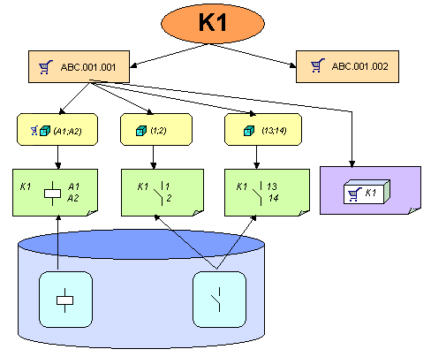

# Конструкция устройств в EPLAN

***Устройства*** являются логическими электротехническими или (гидравлическими / пневматическими) взаимодействующими единицами Fluid-Техники. Им присваивается обозначение устройства (ОУ), например M1, K1, X1, XS1, W1. Устройство состоит из одной или нескольких функций (двигатель, катушка, замыкающий контакт, размыкающий контакт и т. д.). Все функции с одинаковым ОУ относятся к одному и тому же устройству. Одна из функций является так называемой главной функцией. На ней можно выбирать / вводить изделия (исключения: клеммы (изделия можно сохранять только на главных клеммах), контакты штекера, выводы устройства сборной шины и соединения).

Если изделиям присвоены шаблоны функций, они будут отображаться в навигаторе устройств на устройстве.

Устройство может состоять из нескольких ***функциональных элементов*** или только из одного. Функциональный элемент - это часть устройства, которая не может быть разделена на дальнейшие части, например, двигатель, клемма, штекер (несколько штырей, но не гнезда!), вспомогательный блок, кабель.

Функциональному элементу может быть присвоен номер изделия, поэтому функциональный элемент, как правило, представляет одно ***изделие***. Функциональные элементы могут быть представлены на монтажной плате графически.

Функциональные элементы имеют значение только в связи с базой данных изделий или работой с устройствами, а не для логической работы системы (копирование, удаление, использование имеющихся и т.д.). Электротехнические или характеристики Fluid-Техники функционального элемента представлены его ***функциями***. Каждый функциональный элемент может содержать одну или несколько функций.

Функция может быть размещена на схеме соединений и представлена в виде символа. Размещенную функцию мы обозначаем как ***Условное обозначение***. Таким образом условное обозначение соединяет логику с графикой. Символ содержит только графику, а логическая информация поступает из функции (точнее, из определения функции).

***Это означает, что Вы всегда размещаете на схеме соединений функции, а не функциональные элементы!***

На изображениях ниже наглядно показана структура устройств:

Все функции с одинаковым обозначением устройства K1 относятся к одному и тому же устройству. Устройство K1 состоит из следующих функций:

* Катушка для защиты мощности A1;A2
* Силовой замыкающий контакт 1;2, 3;4 и 5;6
* Замыкающий контакт, вспомогательный контакт 13;14
* Размыкающий контакт, вспомогательный контакт 21;22 (не размещено)
* Размыкающий контакт, вспомогательный контакт 58;59.

На главной функции A1;A2 введены два функциональных элемента в качестве изделий: силовой контактор с шаблонами функций "Катушка для защиты мощности A1;A2" и "Силовой замыкающий контакт 1;2, 3;4 и 5;6" и блок вспомогательного выключателя с шаблонами функций "Замыкающий контакт, вспомогательный контакт 13;14", "Размыкающий контакт, вспомогательный контакт 21;22", "Размыкающий контакт, вспомогательный контакт 31;32" и "Замыкающий контакт, вспомогательный контакт 43;44".

Вспомогательные контакты 43;44 и 31;32 еще недоступны в проекте и в навигаторе отображаются как свободные шаблоны посредством шаблонов функций, сохраненных на изделии. То есть, их все еще можно вставить в схему соединений, при этом будет создано соответствующее условное обозначение.

Вспомогательный контакт 21;22 доступен в проекте, но не размещен ни на одной странице.

Вспомогательный контакт 58;59 также относится к устройству K1, однако он не соответствует ни одному из шаблонов функций изделий. Соответствующий контрольный прогон предупредит вас об этом.

**См. также:**

* [Функции](xfctdefbrowsergui_k_start.md)
* [Функции: Принцип](xfctdefbrowsergui_k_prinzip.md)
