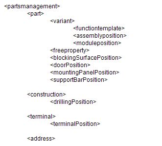

# Импорт и экспорт XML: Обзор тэгов и атрибутов

Импорт и экспорт базы данных изделий происходит при помощи языка XML. Данные в соответствии с этим языком должны быть структурированы следующим образом:

!!! note "Замечание:"

    Тег \<partsmanagement\> можно определить только ***один*** раз! Все остальные теги могут быть определены любое количество раз. Их определение также можно опустить, например, если необходимо задать шаблон функции или схему сверления без указания данных.
    ***Исключение:***
    Для изделия (тег \<part\>) всегда должен быть задан как минимум один вариант (тег \<variant\>)!

### Тэги

[\<partsmanagement\>](xmlexport_o_tags.md)
---
[ \<part\>](xmlexport_o_tags.md)
[\<variant\>](xmlexport_o_tags.md)
[\<functiontemplate\>](xmlexport_o_tags.md)
[\<freeproperty\>](xmlexport_o_tags.md)
[\<blockingSurfacePosition\>](xmlexport_o_tags.md)
[\<doorPosition\>](xmlexport_o_tags.md)
[\<mountingPanelPosition\>](xmlexport_o_tags.md)
[\<supportBarPosition\>](xmlexport_o_tags.md)
[\<assemblyposition\>](xmlexport_o_tags.md)
[\<moduleposition\>](xmlexport_o_tags.md)
[\<attributeposition\>](xmlexport_o_tags.md)
[\<accessoryposition\>](xmlexport_o_tags.md)
[\<accessorylist\>](xmlexport_o_tags.md)
[\<accessorylistposition\>](xmlexport_o_tags.md)
[\<construction\>](xmlexport_o_tags.md)
[\<drillingPosition\>](xmlexport_o_tags.md)
[\<terminal\>](xmlexport_o_tags.md)
[\<terminalPosition\>](xmlexport_o_tags.md)
[\<safetyRelatedValuePosition\>](xmlexport_o_tags.md)
[\<address\>](xmlexport_o_tags.md)
